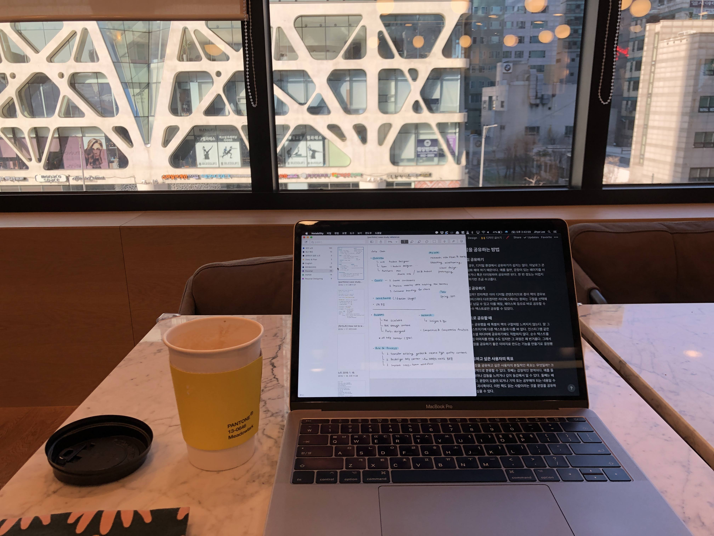
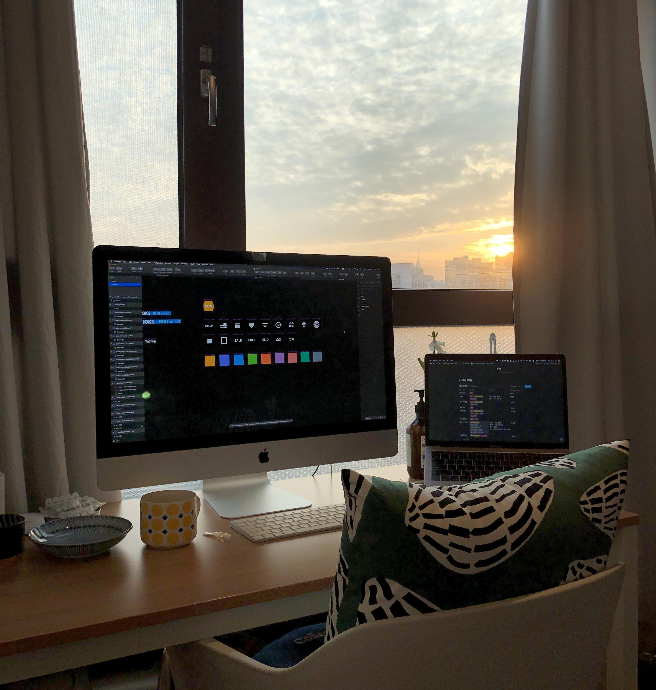
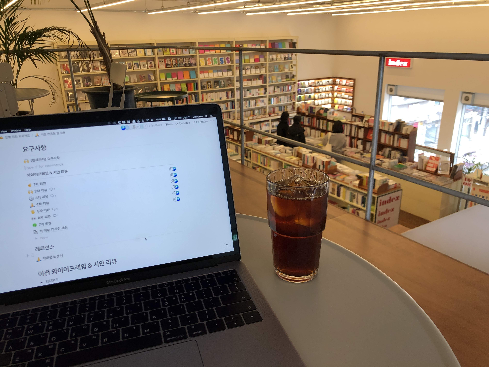
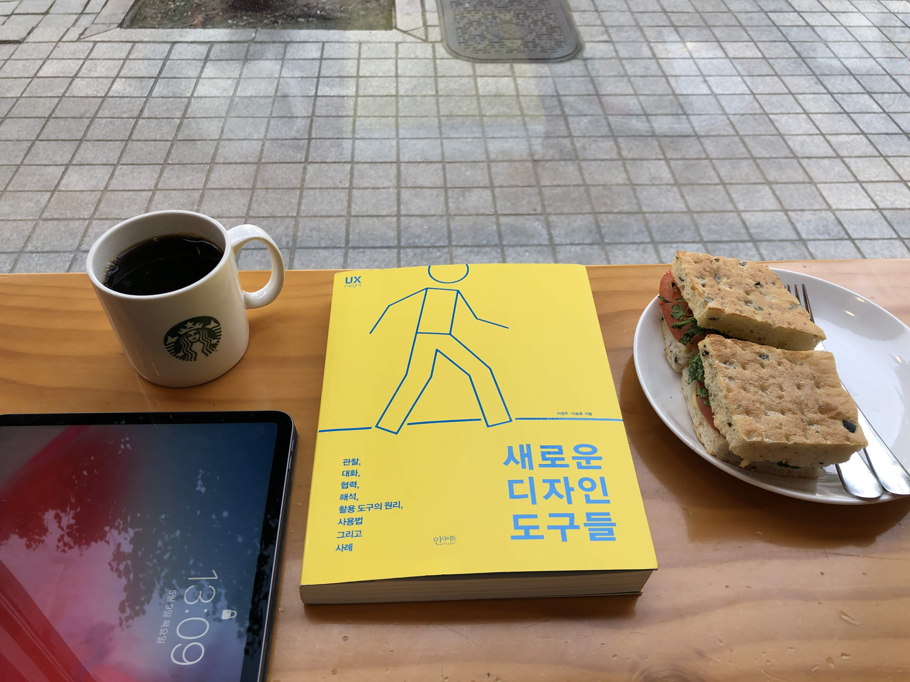
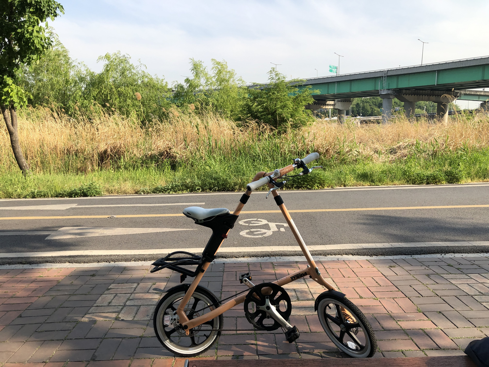
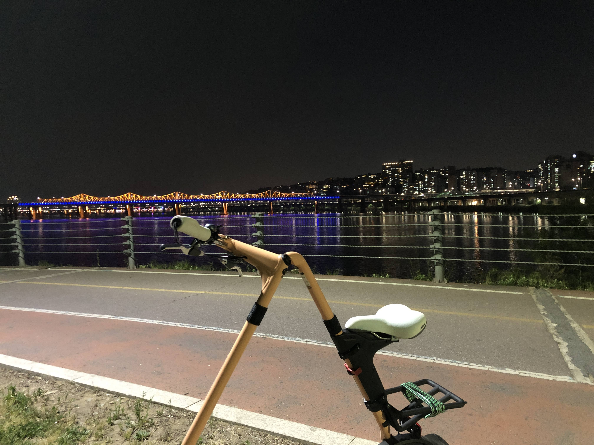
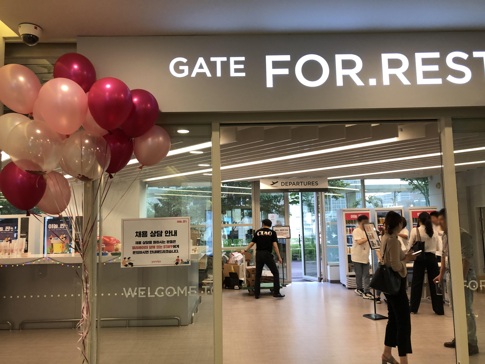
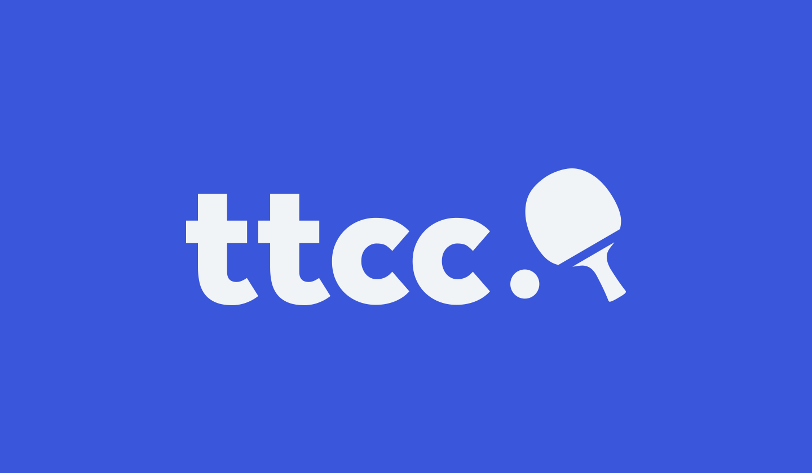
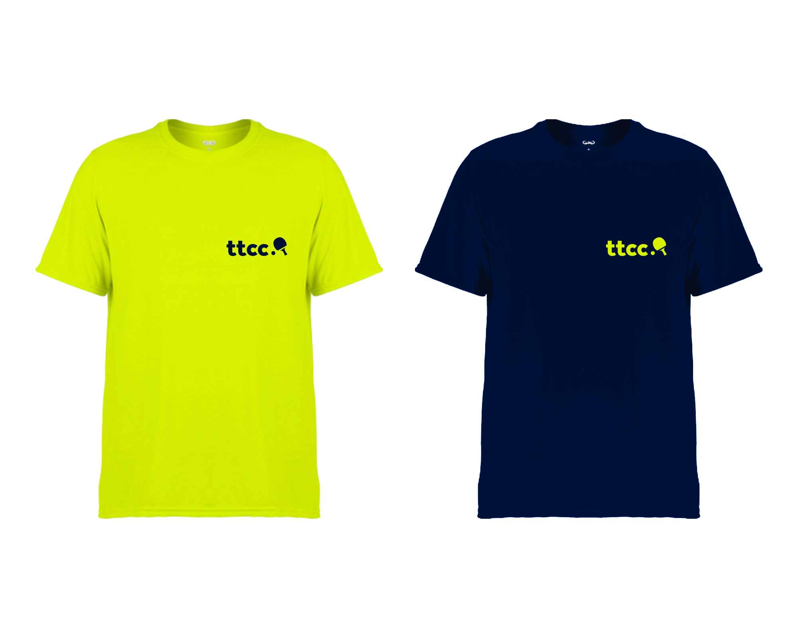
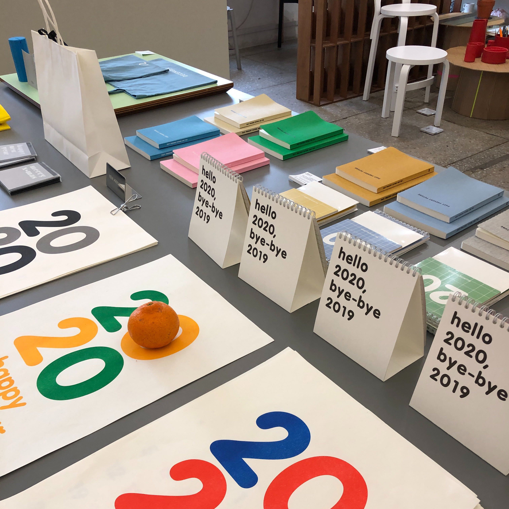

벌써 12월 마지막 주라니 시간은 빠르게도 흐른다. 마지막으로 글을 올리고 거의 딱 1년의 시간이 지났다.

2019년은 회사를 쉬진 않았지만 내가 지정한 안식년이었다. 작년보다 디자이너로서 활동은 많이 하지 않았다. 그렇다 보니 올해 연말 정산 글은 디자이너로서의 이야기보다 개인적인 이야기들이 더 많을 것 같다.

# 1월

## 🧘‍♀️ 요가

한 달 동안 요가를 했다. 심신 안정에도 좋으면서 체력도 증진되는 운동을 하고 싶었다. 한 달만 한 이유는 운동이 많이 되지 않아서다. 작년에 탁구, 1:1 PT를 하다가 요가를 하니 운동량이 충족되지 않았다. 또 여러 명이 함께 하다 보니 선생님께서 한 명 한 명 자세를 살펴봐 주시기 힘들다. 그래서 내 자세가 제대로 된건지 혹시나 다치면 어쩌지 전전긍긍했다. (필라테스로 아킬레스건 힘줄염을 얻은 경험이 한몫했다.)

확실히 심신 안정에는 도움이 되었다. 특히 요가 수업 마지막에 진행되는 사바아사나가 진짜 좋았다. 계속 몸을 움직이다가 마지막에 불을 끄고 바닥에 눕는다. 잔잔한 명상 음악을 들으며 아무 잡념 없이 내 심장 소리에만 귀를 기울이며 심호흡을 하던 그 경험은 잊지 못할 것 같다.

## 🎧 ASMR을 듣기 위해 유튜브 레드 결제

불면증으로 힘들어하던 찰나에 [호그와트 그리핀도르 기숙사 입체 음향](https://youtu.be/5rBg_NjFQmc)이라는 ASMR을 알게 되었다. 이 영상만 들으면 잠이 오는 기적이 일어나서 어쩔 수 없이 유튜브 레드를 결제했고 지금까지 아주 잘 쓰고 있다. (다행히 지금은 ASMR이 없이 잘 잔다.) 

## 👩‍💻 포트폴리오 모임 시작

나를 포함한 디자이너 네 분과 함께 일주일에 한 번 강남에 모여서 포트폴리오를 정리하는 모임을 시작했다. 작업을 시작하기 전 어떤 걸 할 건지 공유한 뒤 작업을 하고, 끝난 뒤 한 번 더 공유하는 식으로 진행했고 총 8주 정도 참여했다.

모임을 하면서든 생각은 역시나 미리미리 정리 하자였다. 작업 시간은 한정되어 있고 정리할 건 많고 나는 게으르고. 그래도 이 모임을 통해서 하나의 글은 쓸 수 있었다. 그거 하나로 뿌듯하다! (👇2월 회고 참고👇) 

## 👊 매일 스쿼트 1개하기 프로젝트

1:1 PT를 끝내고 근력 운동을 거의 하지 않았다. 스쿼트를 하면 한 번에 200개는 거뜬하게 하던 내가 그리워서 매일 스쿼트 1개 하기 프로젝트를 시작했다. 뇌에게는 1개밖에 안되는 목표라고 부담을 줄여준 뒤 추후 더 잉여 개수를 채울 거라는 기대를 했다. 예상은 적중했다.

1월에는 거의 매일 했고 6월까지는 그래도 꾸준히 해냈다. 그 이후로는 탁구에 매진하고 있다.🏓

## 🗣 넥스터즈 강연

개발자·디자이너를 위한 IT 연합동아리 넥스터즈에서 [끊임없이 배우는 디자이너](https://www.facebook.com/Nexterspage/photos/pcb.2221481691216748/2221478901217027/?type=3&theater)를 주제로 강연을 했다. 내가 가진 나름의 노하우를 공유해 드릴 수 있어서 기뻤다. 그리고 다양한 질문들에 대답해드릴 수 있어서 뿌듯했다.

## 📘 1월에 읽은 책

- [딱 1년만, 나만 생각할게요](https://ridibooks.com/books/754024992)

# 2월

## 👩‍💻 원격 근무를 시작하다

개발, 디자인 직군에 한하여 주 1회 원격 근무 제도가 시행되었다. 원격 근무를 위해 산 건 아니었지만 1월에 아이맥을 사놔서 집에서 수월하게 원격 근무를 할 수 있었다.

원격 근무를 해서 제일 좋은 점은 회의 없이 종일 해야 할 일에 집중할 수 있다는 점이 아닐까 싶다. 또 출퇴근 시간 없이 바로 일을 시작할 수 있다는 점도 좋다.

주로 업무와 일상이 구분되지 않는다는 점이 원격 근무의 단점으로 언급된다. 처음엔 무 자르듯이 퇴근하는 게 어렵게 느껴졌다. 이제는 최대한 사무실에서 일하는 것처럼 규칙적으로 일하려고 노력한다. 점심시간도 회사 점심시간에 맞춘다. 브라우저를 업무용과 개인용으로 나눠 쓰는 것도 도움이 된다.

<figcaption>집에서 원격 근무하던 어느 날</figcaption>

<figcaption>건대 커먼그라운드 서점 index에서</figcaption>

## ✍️ 이미지 멋지게 형광펜 공유하기 글 업로드

1월에 시작한 포트폴리오 모임을 통해 [이미지로 멋지게 형광펜 공유하기](https://jihyeleee.com/project/highlight-img-share/) 글을 쓰고 올릴 수 있었다! ~~(그리고 그 이후 글은 없었다고 한다.)~~

처음 글을 쓰겠다고 결심했던 게 작년 5월이었는데 무려 10개월 뒤에야 올릴 수 있었다. 어떻게 보면 게으르다고 볼 수 있다. 하지만 이렇게 가늘고 길게 계속해서 결국은 해내는 게 내 장점이라고 생각한다.

내년엔 또 어떤 글을 10개월에 걸쳐 써낼지 궁금하다. 👀

## 📘 2월에 읽은 책

- [선 긋기의 기술](https://ridibooks.com/books/510000764)
- [마케터의 일](https://ridibooks.com/books/2639000010)

# 3월

## 📕 <인스파이어드> 스터디 마무리

회사에서 PM, 디자이너, 개발자가 모여서 마티 케이건이 쓴 <인스파이어드>를 함께 읽는 스터디를 1월에 시작했다.

스터디에서 각 팀의 대표 격으로 모여서 어떻게 일하고 있는지 같이 얘기할 수 있어서 좋았다. 각 팀의 애로사항도 알 수 있었고 우리 제품 문화에 관해 얘기하는 거 자체가 좋았다.

이 책이 좋은 제품 문화 에반젤리스트 역할을 해준 것 같다. 그래서 일회성으로 끝나기보다 계속 다양한 팀이 모여서 하면 좋겠다고 생각했다. 지금은 새로 비슷한 시기에 입사한 PM, 디자이너가 모여서 <인스파이어드> 스터디를 진행하고 있다.

최근에 사용자 리서치에 관해 공부하면서 다시 <인스파이어드>를 부분부분 읽었는데 오랜만에 읽어도 참 좋았다. 2020년에 다시 정주행해야겠다.

## 📘 3월에 읽은 책

- [인스파이어드](http://www.yes24.com/Product/goods/67512293)
- [나는 4시간만 일한다](https://ridibooks.com/books/2855000005)
- [라틴어 수업](https://ridibooks.com/books/745000083)

# 4월

## 🏥 처음으로 혼자 응급실행

정말 우습게도 내가 만든 미역국을 먹고 탈이 났다. 4월이라 괜찮을 줄 알고 상온에 보관한 미역국이 문제였다. 상한 음식을 먹고도 알아차리지 못하고 계속 먹게 만든 내 미각이 원망스러웠다.

새벽 12시부터 응급실에 가도 될지, 혼자서 갈 수 있을지를 고민하다가 5시가 되어서야 응급실로 갔다. 처음 혼자서 간 응급실에서 보호자가 있냐는 물음에 괜스레 눈물이 났다. 하지만 7월에 또 혼자 응급실을 갔고 이제는 아파서 혼자 응급실 가는 게 별거인가 싶을 정도로 잘 간다.

## 📘 4월에 읽은 책

- [HBR이 제시하는 재미있고 신선한 아이디어](https://select.ridibooks.com/book/3120000068)
- [저 청소일 하는데요?](https://select.ridibooks.com/book/222002076)

# 5월

## 📚 트레바리 시작

5월부터 8월까지 트레바리 <1코노미> 클럽에 참여했다. '1코노미'라는 단어에 처음 눈길이 갔다. 나도 1인 가구, 즉 1코노미족이기 때문이다. <1코노미> 클럽의 설명과 상관없이 내가 떠올린 단어는 '1인 경제 활동'이었다. 남은 인생이 얼마나 될지 모르지만 혼자서 오롯이 경제 활동을 이어나가야 한다고 생각했다. 지금은 일이 있지만, 언제까지 디자이너로 일할 수 있을지 모른다. 그래서 혼자서 할 수 있는 일들을 찾아야 한다고 은연중에 생각해 왔던 것 같다. 그런 나에게 <1코노미> 클럽 활동이 도움을 줄 수 있지 않을까 싶었다.

결론적으로 말하면 특정 책보다는 나와 비슷한 생각을 하는 1코노미 사람들을 만나고 진지한 이야기를 나눌 수 있어서 좋았다. 트레바리는 사람들이 정말 좋다는 얘기를 엄청 많이 들었는데 사실이었다.

하지만 계속해서 트레바리를 하진 않을 것 같다. 잡학 다식으로 여러 책을 읽으며 지식을 쌓는 타입인데, 읽어야 하는 책이 정해져 있다 보니 트레바리를 하는 동안엔 다른 책을 읽지 않게 된다. 그리고 선정된 책이 재미가 없거나 취향에 맞지 않은 경우 모임 자체를 나가지 않게 돼서 돈이 아까웠다. 트레바리 모임 경험은 한 번으로 족한 것 같다.

<figcaption>첫 트레바리 모임을 준비하던 날 스벅에서 나의 으뜸이 빵 햄 치즈 루꼴라 샌드위치와 함께</figcaption>

## 🚴‍♀️ 자전거

드디어 자전거를 샀다. 내 주변 사람들은 알겠지만, 자전거를 사기까지 약 5년 동안 고민했다. 자전거를 살 만큼 많이 타게 될까? 어차피 따세권인데 따릉이를 타면 어떨까? 혼자 사는데 짐이 너무 많아지는 건 아닐까? 밖에 보관하면 자전거를 도둑 맞을 텐데 집에 보관할 수 있을까? 겨울, 여름에는 못 탈 텐데 아깝진 않을까?

5년의 고민이 무색할 정도로 자전거를 진짜 많이 탔다. 물론 고민했던 것처럼 한여름, 한겨울에는 탈 수 없지만 전혀 후회하지 않는다. 한동안은 자전거를 타며 본 풍경에서 얻은 힘으로 살았다고 해도 과언이 아니다. 자전거를 탈 때만큼은 눈 앞에 펼쳐진 풍경을 감상하며 노래를 들으며 아무 생각 없이 있을 수 있어서 좋았다.

접이식 자전거를 사서 보관 문제도 해결할 수 있었다. 접으면 1/4 정도로 줄어들어서 현관 한쪽에 보관하면 된다. 원래는 바퀴가 큰 자전거를 사고 싶었다. 보관 문제 때문에 스트라이다를 샀지만 후회하지 않는다. 생각보다 속도도 잘 나고 언덕도 근력만 있으면(?) 올라갈 수 있다.

<figcaption>옥수역과 응봉역 사이 어딘가에서</figcaption>

<figcaption>동호대교와 성수대교 사이. 중랑천과 한강 사이. 한동안 퇴근 후 하염없이 동호대교를 바라보는 게 내 스트레스 해소법이었다.</figcaption>

## 📘 5월에 읽은 책

- [새로운 디자인 도구들](http://www.yes24.com/Product/Goods/66319093)
- [말 그릇](https://select.ridibooks.com/book/1775000056)

# 6월

## 🏓 탁구 레슨, 다시 시작

1년 동안 쉬었던 탁구 레슨을 다시 시작했다. 작년에 탁구를 잘 치기 위한 근육을 만들기 위해 1:1 PT를 받으면서 탁구를 쉬었다. PT가 끝난 후에는 개인적인 이유로 탁구 레슨을 시작하지 못했다. 아예 그만둘까도 생각했다. 그동안 배웠던 게 아까웠고 다시 배우기로 했다. 지금까지 7개월째 쉬지 않고 열심히 매주 두 번씩 레슨을 받고 있다.

올해로 벌써 4년째 탁구를 하고 있다. 어쩌다 탁구라는 운동에 빠져서 매주 내 소중한 평일 시간을 할애하며 열심히 하고 있을까. 제일 큰 원동력은 경쟁심이 아닐까 싶다. 어떻게든 이겨야 직성이 풀리는 내 성격이 탁구를 계속 연습하게 만든다. 모두를 이길 순 없다. 그래도 늘 이기고 싶다.

## 🏃‍♀️ 야놀자 놀러 가기

지인의 초대로 야놀자에 놀러 갔다. (나중에 글을 쓰며 찾아보니 '야놀짠'이라는 행사였다!) 우선 1인당 500ml 맥주 두 캔을 주는 데서 센스가 느껴졌다. 맥주도 맛있었다. 또 한쪽에서는 채용 상담 안내까지 진행되고 있었다. 파티에 채용을 녹인 아이디어가 참 좋았다. 자연스럽게 야놀자에 대해 소개 받고 쇼룸도 구경했는데 재밌었다. 우리도 언젠가 이런 행사를 하게 된다면 도움이 많이 될 것 같다.

## 📘 6월에 읽은 책

- ['나'라는 브랜드](http://www.yes24.com/Product/Goods/61301678)
- [여자 둘이 살고 있습니다](https://select.ridibooks.com/book/734001720)
- [연애하지 않을 권리](https://select.ridibooks.com/book/1775000071)
- [나는 내 파이를 구할 뿐 인류를 구하러 온 게 아니라고](https://ridibooks.com/books/2016000103)

# 7월

## 👩‍💻 스펙트럼 콘 2019 커리어 코칭 참여

[스펙트럼 콘 2019](https://www.wanted.co.kr/events/spectrumcon2019)에서 커리어 코치로 참여했다. 오프라인 코칭은 2018년 스포카 포트폴리오 리뷰 행사 이후로 처음이었다. 그래도 그간 해 여러 코칭 경험을 통해 노하우가 쌓여서 수월하게 할 수 있었다.

늘 코칭 행사를 하면 일방적으로 리뷰만 하는 게 아니라 나 또한 인사이트를 많이 얻는다. 더 열심히 살아야겠다는 힘을 얻는다.

## 🏓 사이드 프로젝트 MatchPoint 시작

탁구 리그전 대진표를 쉽게 작성할 게 도와주는 사이드 프로젝트를 시작했다. 탁구를 함께 치는 개발자 친구와 함께 프로젝트도 하고 있다. 

개인적인 불편함에서 시작한 프로젝트다. 탁구 리그전을 할 때 대진표 양식을 A4 용지로 출력해서 어느 한 곳에 두고 게임이 끝날 때마다 가서 스코어를 적고 이를 바탕으로 순위를 가린다.

근데 대진표에는 똑같은 이름이 행과 열에 모두 적혀 있고 내 스코어는 어디에 적는지, 상대방 스코어는 어디에 적는지 매번 헷갈린다. (이제 익숙해 질 만도 한데...) 또 순위도 직접 승패 수나 세트 수를 한 명이 계산해서 결산해야 하는 것도 불편했다. 일단은 많은 변수 없이 최대한 심플하게, 컴포넌트는 적게 만들고 재사용할 수 있게 기획하고 디자인했다. (더 뺄 수 있는 페이지들이 있다면 빼고 싶다.)

[Figma에서 전체 프레임 보기 🔗](http://bit.ly/2srZenM)

### 프로토타입 👇

<iframe style="border: none;" width="100%" height="700" src="https://www.figma.com/embed?embed_host=share&url=https%3A%2F%2Fwww.figma.com%2Fproto%2FH6FV2Qshzm37UVQoN7OgLJ%2F%25F0%259F%258F%2593-MatchPoint%3Fnode-id%3D1%253A11%26scaling%3Dscale-down" allowfullscreen></iframe>
# 8월

## 📱 Interface Lovers에 푹 빠지다

8월부터 빵을 먹고 커피를 마시며 [Interface Lovers]()를 읽는 게 내가 좋아하는 아침 일과였다.

우선 영어 공부 할겸 마치 그 디자이너가 된 것처럼 소리내서 읽곤 했다. 나와 비슷한 삶의 궤적을 가진 디자이너의 인터뷰는 따로 저장도 해놓고 영어권에서 디자이너로 일할 때 써먹을 수 있겠다 싶은 표현은 따로 적어두기도 했다.

질문 중에 'What does a typical day look like?' 대한 답변을 읽는 게 제일 재밌었다. 디자이너들의 하루 일과를 읽으면 별거 아닌 나의 일상도 특별하게 느껴졌다. 또 열심히 사는 일과를 읽으면서 아침부터 자극을 받기도 했다. 영감을 주는 인터뷰는 밥을 다 먹고 회사에 출근하면서도 계속 이어서 읽기도 했다.

먼 다른 나라의 모르는 디자이너들 이야기만 보다가 [Protopie의 해나 님 인터뷰](https://interfacelovers.com/interviews/haena-claire-shin)를 발견했을 땐 너무 반가웠다. 멋진 해나 님! 나도 언젠가는 Interface Lovers에 나온다면? 😵 상상만 해도 더 열심히 삶의 궤적을 만들어나가야 할 것 같다.

한편으로 한국판 Interface Lovers를 만들고 싶기도 하다. 내년에 한 번 생각해 봐야지!

## 🏓 탁구 동호회를 위한 로고, 티셔츠 디자인

ttcc라는 탁구 동호회의 로고와 티셔츠 디자인을 진행했다. ~~(아쉽게도 현재 동호회는 사라졌다.)~~

<figcaption>탁구대 컬러에 동호회 이름이 ttcc이다 보니 왠지 toss 느낌이...</figcaption>

## 📘 8월에 읽은 책

- [하면 좋습니까?](https://select.ridibooks.com/book/734001798)

# 9월

## 👩‍💻  Figma 스터디 시작

사내에서 Figma 스터디를 시작했다. 사실 Figma를 힙한 브랜딩에 협업을 쉽게 할 수 있는 툴 정도로 생각하고 있었다. 근데 스터디를 하며 써보니 장점들이 진짜 많은 것 같다.

우선 Sketch와 Invision, Zeplin을 Figma 하나로 쓸 수 있다. 특히 Invision, Zeplin 대체는 너무 편하다. 둘다 Sketch를 수정하면 내부 툴이 아니기 때문에 무조건 다시 업로드를 해줘야 하는데 Figma는 그럴 필요가 없다. 당연하게도 바로바로 반영된다.

Sketch는 오프라인이 디폴트고 로컬에서 파일을 쌓아서 쓰는 툴이기 때문에 파일을 공유하려면 Sketch Library든, 드롭박스든, 나스든 무언가를 통해야 한다. 하지만 Figma는 디폴트가 온라인이고 클라우드가 기본이기 때문에 공유할 때 너무 편하고 파일 관리도 쉽다. 그래서 동기화도 아주 편하다!

물론 아직 부족한 점도 많다. 하지만 계속해서 사용자가 원하는 새로운 기능들이 추가되는 걸 지켜봐 오고 있기에 믿음이 간다. 당분간은 계속 Figma로 이사를 하지 않을까 싶다.

## 📘 9월에 읽은 책

- [여자라는 문제](https://select.ridibooks.com/book/1558000197)

# 10월

## 리디바탕 소개 페이지 디자인 & 퍼블리싱

한글날에 공개된 전자책 전용 글꼴 리디바탕 소개 페이지를 디자인하고 퍼블리싱했다. 최대한 글자 자체에 집중할 수 있게 미디엄 같은 블로그 느낌으로 설명글을 읽을 수 있도록 구성했다. 그러다 보니 직접 퍼블리싱하기에도 편했다. 공개되고 나서는 개발자처럼 IE 버그도 대응해 보는 경험도 했다!

[리디바탕 다운로드하러 가기 🔗](https://www.ridicorp.com/branding/fonts/ridibatang/)

## 🏓 첫 탁구대회 출전

생애 첫 탁구대회에 출전했다. 탁구를 시작한지 4년만에 나간 대회에서 그래도 예선은 통과하고 본선에서 탈락했다. 그것만으로 뿌듯하다! 내가 대회를 나갈 수 있을까 생각했는데 막상 나가보니 별 게 아니었다. 유리 멘탈이라 걱정했지만 크게 떨지도 않았고 생각보다 잘 해냈다. 기세를 이어서 11월에도 성동구 탁구대회에 출전했다. 내년에는 더 많은 대회를 나가야지!

# 11월

## 📘 11월에 읽은 책

- [파워풀](https://select.ridibooks.com/book/703000424)
- [독서 천재가 된 홍 팀장](https://select.ridibooks.com/book/372001499)
- [꼭 필요한 만큼의 리서치](http://www.yes24.com/Product/Goods/45514761)

# 12월

## 🥂 디자이너 파티 참여

작년에 이어 여성 디자이너 만찬, 스펙트럼 파티에 참여했다. 오랜만에 뵙는 디자이너분들의 근황도 듣고 처음 뵙는 디자이너분들과도 각기 다른 환경의 다양한 디자인 이야기를 나눌 수 있어서 좋았다. 😆

## 리디북스 서점 홈 개편 런칭

오랫동안 준비해 온 리디북스 서점 홈 개편이 런칭되었다. 아직 해결되지 않은 이슈들도 많고 최적화도 더 필요하지만, 우선은 엄청 큰 문제는 없이 런칭되어서 다행이라고 생각한다. (더 개선할 일이 아직 많다... 🙏)

서점 홈 개편도 그렇지만 프로젝트가 배포될 때마다 '사용자 리서치'가 절실히 필요하다는 걸 느낀다. 특히 너무 다양한 사용자가 존재하는 리디북스 서점에서는 반드시 필요하다고 본다. 또 배포 전 라이브한 사용자 의견을 받을 방법에 대해서도 고민이 필요하다. 내년의 숙제가 아닐까 싶다.

## 📘 12월 거의 다 읽은 책

- [질문이 답을 바꾼다](https://ridibooks.com/books/280000005)
- [아내가 창업했다](https://ridibooks.com/books/1890000080)

# 마치며

안식년이라고 생각했는데 회고를 적다 보니 블로그 글만 안 썼지 생각보다 많은 걸 해낸 2019년인 것 같다. ~~(블로그에만 소홀했던 것 같다.)~~  매번 교훈이나 결심으로 글이 끝나면 안 되지만 내년에는 디자인 관련 글이 아니더라도 가볍게 블로그 글을 많이 남기고 싶다.

(2019년에 읽은 리디북스, 리디셀렉트 책들은 [이 링크](https://jihyeleee.com/book/2019-books-i-read/)를 누르면 볼 수 있다.) 

<figcaption>hello 2020, bye-bye 2019! @mmmg</figcaption>

# 🙋‍♀️ 마지막으로 채용 공고 홍보!

RIDI에서 디지털 프로덕트 디자이너를 뽑고 있습니다! 자세한 채용 공고가 궁금하시다면 아래 이미지를 클릭해 주세요! 👇

<a href="http://bit.ly/2qoo3wp">