2021년이 된 지도 벌써 두 달이 다 되어간다. 2020년 회고를 하기에 조금 늦은 감이 있지만, 늦더라도 적는 게 나을 것 같아서 작성해 본다.

사실 2020년 연말 정산 글을 작성하지 않으려고 했다. 이유는 별거 없다. 12월 코너에서 얘기하겠지만, 오랜 기간 다닌 회사를 퇴사한 후 아무 것도 하고 싶지 않았다. 번아웃인 건지, 뭔가를 하고 싶다는 열망이 생기지 않았다. 특히 업무와 관련된 건 외면하고 싶었다. 마냥 쉬고 싶었다.

1주 차에는 넷플릭스를 보며 침대를 벗어나지 않았다. 2주 차에는 책을 읽기 시작했다. 이렇게 쉬는 동안 한 주마다 태스크의 레벨을 조금씩 높여 나갔다. 이제 어느 정도 번아웃을 벗어난 것 같고, 2020년 회고를 작성할 용기가 생겼다.

# 1월

## Design System 발표

회사에서 디자인 시스템을 주제로 발표를 했다. 1월과 2월에 걸쳐서 두 번에 나눠서 발표했다. 1월에는 전반적인 디자인 시스템과 관련된 이야기를 다뤘다. 디자인 시스템이 무엇이고, 구성 요소는 무엇인지, 왜 디자인 시스템을 만들어야 하는지, 대표적인 디자인 시스템에는 무엇이 있는지 이야기했다. 2월에는 리디 디자인 시스템에 관해 이야기했다. 지난 1년 동안 어떤 문제를 풀기 위해 어떤 일들을 했는지, 앞으로 해야 할 일은 무엇인지 다뤘다. 

오랜만에 하는 발표라서 정말 떨렸다. 다시 한번 나는 발표형 인간이 아니라는 사실을 느꼈다. 많은 사람 앞에서 물 흐르듯 자연스럽게 발표를 해나가는 분들을 보면 너무 부럽다. 기본적으로 갖춘 능력도 있겠지만, 연습도 많이 할 것이다. 뭐든 잘하려면 계속해보는 수밖에.

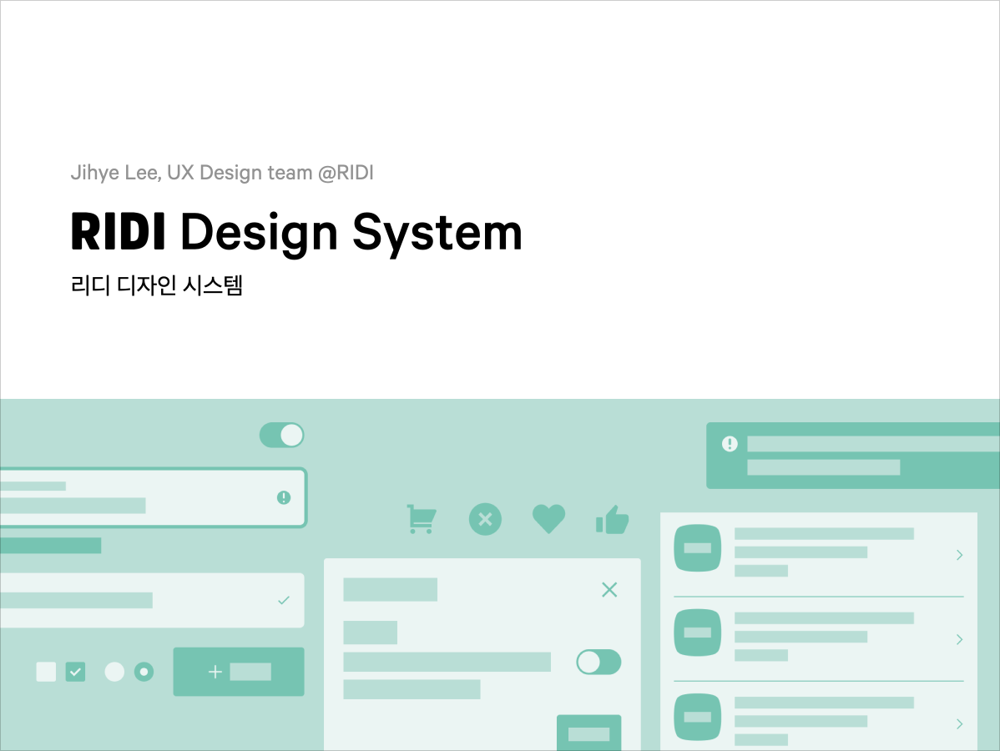

## 업무 환경과 일상생활 구분하기

1월에는 일주일에 한 번 원격근무를 하던 때긴 했지만, 업무 환경과 일상생활을 구분하고 싶었다. 원룸에 살기 때문에 완전히 구분할 수는 당연히 없었다. 그래도 테이블을 하나 더 구매함으로써, 식사하고 쉬는 테이블과 업무를 하는 책상을 구분할 수 있었다.

원룸이지만 그래도 하나의 테이블을 더 놓을 수 있는 평수에 살고 있다는 사실에 감사했다. 하지만 원격근무가 보편화되어 가고 있기 때문에, 다음에는 꼭 분리형 원룸 혹은 투룸으로 이사를 가서 업무 환경과 일상생활을 확실히 구분해 주고 싶다.

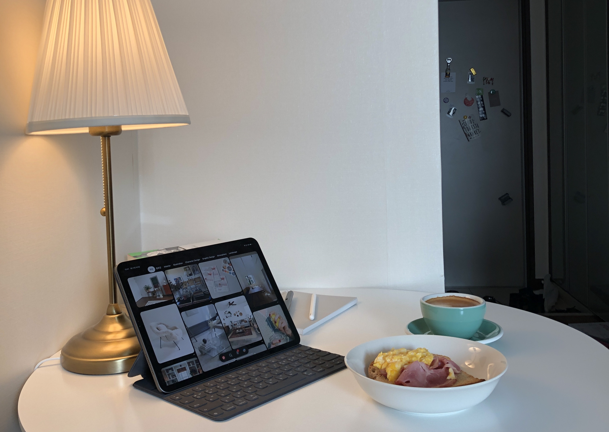

<figcaption>새로 산 원형 테이블. 이 곳에서는 식사하고 책을 읽고 인터넷 서핑을 하며 쉰다.</figcaption>

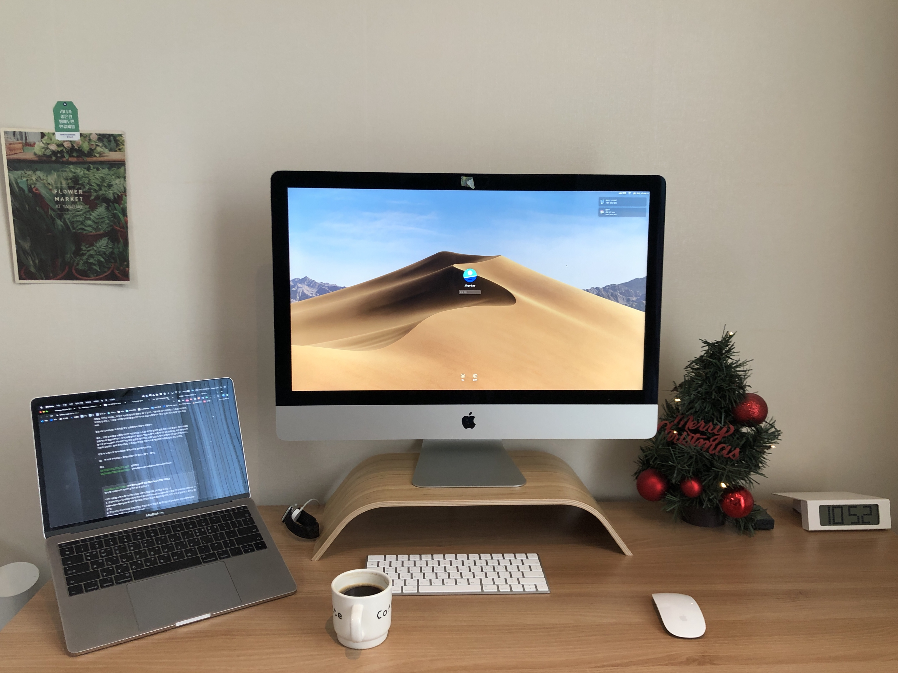

<figcaption>업무를 하는 책상. 아이맥 모니터 받침대는 이케아 제품인데, 사실 아이맥 하중을 견딜 수 없는 제품이다. 그런데 쇼룸에는 아이맥 비스무름한 가짜 컴퓨터를 올려놓아서 사람을 헷갈리게 한다. 그런데도 디자인을 포기할 수 없어서 샀다.</figcaption>

## 📘 1월에 읽은 책

- [일의 기쁨과 슬픔](https://ridibooks.com/books/754027238)

# 2월

## 제주도 여행

코로나가 심해지기 전, 2월 둘째 주에 제주도에 다녀왔다. 수학여행 이후로 두 번째 제주도 여행이었다. 첫 번째 여행 때는 2박 3일 내내 장마 때문에 제대로 된 제주를 느낄 수 없었다. 이번에는 그래도 대체로 날씨가 좋아서 푸르른 바다도, 높은 하늘도 볼 수 있었다. 숙소에서 먹은 한라토닉과 고등어회도 꿀맛이었다. 처음으로 전기차를 타보고, 충전도 해보는 경험을 해봤다. 차를 산다면 전기차를 사야겠다는 생각도 하게 되었다. 다음에 갈 때는 나도 운전을 할 수 있다면 좋겠다.

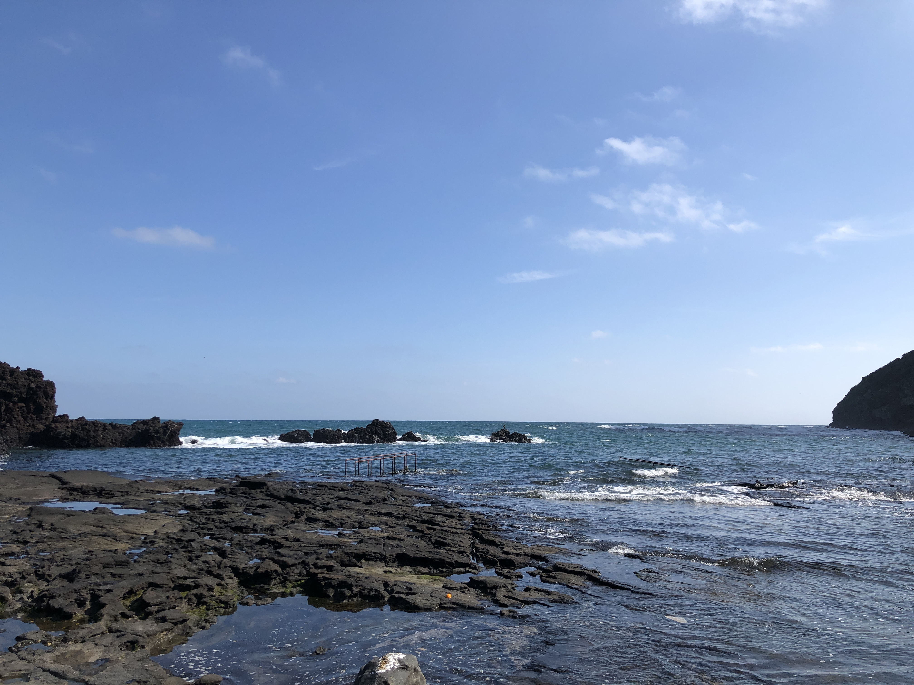

<figcaption>성산 일출봉의 우뭇개 해안에서</figcaption>

## RIDI Code 포스터 제작

새로 정립된 미션과 코드들로 포스터를 제작했다. 그래픽 요소 중에 '원형'에 집중해서 작업했다. 원은 꽤 많은 의미를 보여줄 수 있다고 생각했다. 우선 미션에 포함된 '통찰력', '상상력'은 말풍선의 형태로 보여줄 수 있다. '집중', '세계적 관점', 더 나아가 넓은 의미에서 계속 순환하는 개념으로 '끈기'(지금은 '집요함'으로 변경되었다), '건강한 삶'의 선순환까지 표현할 수 있다. 그래서 다양한 원의 형태로 포스터를 제작했다. 오랜만에 하는 포스터, 그래픽 작업이라 재밌었다.

<figcaption>RIDI Code 포스터</figcaption>

## 📘 2월에 읽은 책

- [배움의 발견](https://ridibooks.com/books/1242000898)

# 3월

## 원격근무 팀 운영 경험 공유

매니저들이 모이는 m-sync 데이에서 발표를 했다. 코로나 19 이전에도 UX 디자인 팀은 주 1회 원격 근무를 해오고 있었다. 그래서 전면 원격근무가 시행되었을 때도 조금 더 수월하게 팀을 운영할 수 있었다. 이를 바탕으로 처음 원격 근무를 도입하는 매니저들을 위해서 경험을 공유했다. 경험 공유에 앞서서 원격근무의 단계와 유형을 비교하고, 관련된 용어들을 정리해서 이해를 도왔다.

코로나 19로 인해 온라인으로 발표했다. 온라인 발표는 처음이었는데, 대면 발표만큼이나 떨렸다. 그래도 이번엔 연습을 많이 해서 떨린 티가 거의 나지 않았다. 손에 꼽는 뿌듯했던 발표였다.

## 동네에서 벚꽃 구경

북적이는 거리를 좋아하지 않지만, 그래도 벚꽃이 피면 벚꽃으로 유명한 거리에 가서 부대끼며 벚꽃 보기를 나름 좋아했다. 하지만 이번에는 코로나로 그럴 수 없었다. 그래서 동네에서 벚꽃 나무를 찾아다니며 벚꽃을 구경했다. 일상 속의 벚꽃이라 나쁘지 않았다. 오히려 좋았다.

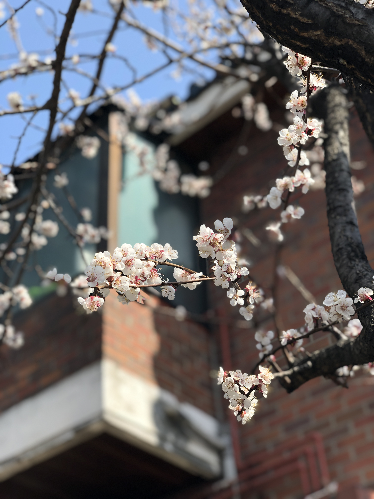{: width="100%" height="100%"}

<figcaption>쓰레기를 버리러 나갔다가 만난 집 앞 벚꽃</figcaption>

## 인스타그램을 그만두다

3월을 기점으로 인스타그램을 그만두었다. 정확히는 인스타그램에 이미지 업로드를 그만두었다. 딱히 크게 결심한 건 아니었다. 우선 오랜 방콕 생활로 올릴 만한 게 없었고, 이참에 소셜 네트워크에서 멀어져 보면 어떨까 생각했다. 2020년 12월, 퇴사 후 하나의 이미지를 올린 걸 제외하고는 아직 인스타그램에 사진을 업로드를 하지 않고 있다. 자연스럽게 피드도 보지 않고, 정보를 검색할 때만 사용한다.

사실 인스타그램을 처음 할 땐 일기처럼 하루하루 나의 일상을 기록하는 용도가 다였다. 하지만 팔로잉하는 계정이 늘어나면서, 많은 사람의 눈부시고 멋진 일상을 습관적으로 보게 되었다. 나도 모르게 나의 삶과 인스타그램의 팔로잉한 사람들과 삶을 비교하기 시작했다. 인스타그램을 거의 하지 않는 지금, 전보단 덜 비교하며 내 삶에 집중하게 되었다는 점, 그게 제일 큰 수확이지 않을까 싶다.

# 4월

## 전세 계약

월세 만기가 약 석 달 앞으로 다가와서 집을 알아보기 시작했다. 이번에는 기필코 전세로 가겠다는 뚜렷한 목표가 있었기에 더 빠르게 알아보기 시작했다. 원격근무가 많아지면서 꼭 투룸으로 가고 싶었다. 지금 사는 지역 외에도 추가로 다른 지역들을 거점으로 집을 알아봤다.

매물은 생각보다 많았지만, 금방 사라지기 일쑤였다. 그래도 전세로 갈 수 있겠다는 희망을 보았고, 집을 나갈 거라고 집주인에게 고지했다. 그리고 혹시나 월세를 전세로 전환할 수 있을지도 살포시 문의했다. 중간에 논란도 있었지만, 운 좋게 전세로 전환하게 되었다. 투룸으로 꼭 가고 싶었지만, 2년 뒤를 기약하며 도장을 찍었다.

## 반짝 경제 공부

전세 계약을 하며 진짜 어른이 된 것 같았다. 전세 자금 대출도 받고, 부동산 없이 재계약도 해보고, 확정 일자도 다시 받고. 하지만 이 와중에 나의 재테크 기술이나 경제적 지식이 많이 부족하다는 사실을 깨달았다. 그래서 경제 공부를 시작했다. 경제 공부를 시작하는 사람이라면 꼭 봐야 한다는 'EBS 다큐프라임 자본주의' 5부작을 학교에서 강의 듣듯이 공부했다. 뱅크샐러드의 매거진도 많이 읽고, &lt;경제기사 궁금증 300문 300답&gt; 책도 사서 읽기 시작했다. &lt;부자 아빠 가난한 아빠&gt;, &lt;부의 추월차선&gt;도 읽었다. &lt;부의 추월차선&gt;은 &lt;4시간만 일한다&gt; 책과 일맥상통하는 내용이 많았지만, 그래도 재밌게 읽었다.

## 📘 4월에 읽은 책

- [부자 아빠 가난한 아빠](https://select.ridibooks.com/book/682000717)
- [부의 추월차선](https://select.ridibooks.com/book/1354000008)

# 5월

## 베이킹 도전

인생 최초는 아니지만, 혼자서 제대로 베이킹에 처음 도전해봤다. 베이킹이라고는 했지만, 스콘 한 종류만 만들었다. 스콘이 그나마 제일 재료도 적게 들어가고, 레시피도 간단했기 때문이다. 생각보다 맛있어서 만들어서 주변에 나눠주기도 했다. 그때 잠깐 반짝 베이킹을 즐기다가 지금은 하지 않고 있다. 시간이 많은 요즘, 다시 도전해봐야겠다.

<figcaption>생긴 거와 다르게 그래도 맛있는 스콘</figcaption>

## 숲과 물, 자전거와 함께 스트레스 해소
사주를 엄청나게 믿지 않지만, 水가 부족하다는 걸 알았을 때 신기했다. 왜냐면 물가에 가는 걸 엄청나게 좋아하기 때문이다. 정말 극소수의 숙소를 제외하면, 여행 갈 때는 무조건 바다나 강이 보이는 곳에 숙소를 잡고, 강이나 바다만 보면 너무 행복해하는 사람이다.

애석하게도 우리 집에서는 물이 보이지 않지만, 다행히도 조금만 걸으면 물을 볼 수 있는 곳에 살고 있다. 그래서 5월에는 가까운 곳에서 봄기운을 즐기기 위해 집 근처의 중랑천과 한강, 청계천을 자주 갔다. 더불어 강은 없지만 호수가 있고, 한강과 중랑청이 가깝고, 나무가 많은 서울숲에도 자주 갔다.

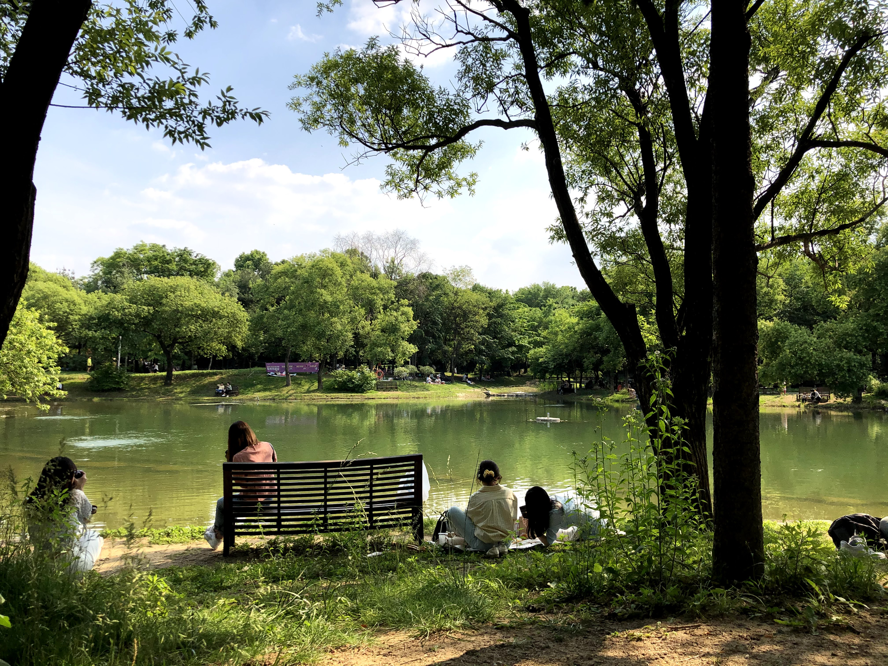
<figcaption>서울숲에서 제일 좋아하는 공간</figcaption>

## 📘 5월에 읽은 책

- [Data-Driven UX](http://www.yes24.com/Product/Goods/74410174)

# 6월

## 집 구조 변경
초여름을 맞이하여 집 구조를 변경했다. 책상을 에어컨 밑으로 옮겨서 일할 때 시원하게 유지할 수 있게 했고, 창가 근처로 침대를 옮겼다. 테이블은 부엌과의 접근성을 고려해서 같은 곳에 두었다. 원격으로 회의할 때마다 침대가 뒤에 있어서 신경 쓰였는데 편하게 회의를 할 수 있게 되었다.

<figcaption>처음 해 본 집 구조. 진짜 오피스 느낌이 나서 좋았다.</figcaption>

# 7월

## 직책 변경, 조직 이동
7월 초, 전체적으로 조직에 많은 변화가 있었다. 우선 나에게 일어난 변화를 짧게 요약하자면 팀장에서 IC로 직책이 변경되었고, RIDI 조직에서 글로벌 웹툰 제품을 만드는 목적 조직으로 이동하여 팀 내 1인 디자이너로 일하게 되었다. 그러면서 사무실도 옮기게 되어 Wework에 있는 사무실로 이동하게 되었다. 갑작스럽게 다양한 변화가 일어나서 당황하기도 했고, 5년 만에 새로운 회사를 가는 느낌이 들어서 신기하기도 했다. 또 다양한 역할이 함께 일하는 목적 조직에서 처음 일해보게 되었는데, 나한테 잘 맞았다. 짧지만 Wework에서 일한 경험도 좋았다.

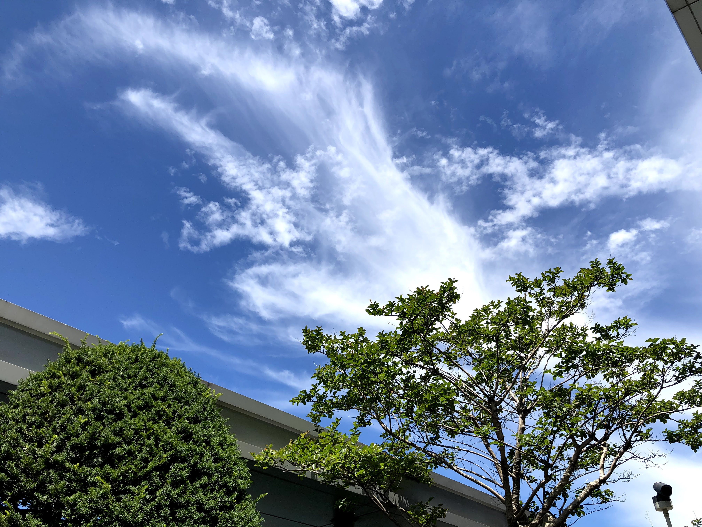
<figcaption>Wework 옥상에서</figcaption>

## 매치포인트 앱 첫 배포
거의 1년 동안 만들던 앱을 배포하였다. 작년 회고에도 언급했던 탁구 리그전 대진표를 손쉽게 작성할 수 있는 '매치포인트 matchpoint'라는 앱이다. [Android](https://bit.ly/android-matchpoint)를 먼저 배포하고, 이후 [iOS](https://bit.ly/ios-matchpoint)도 배포했다. 서버도 쓰지 않는, 간단한 앱이라 오래 걸리지 않을 거라고 예상했지만 아니었다. 그래도 일단 드디어 배포해내서 뿌듯했다. 코로나 시국이라 탁구 모임 자체가 거의 없어서 매치포인트 앱을 활용할 기회 자체가 적어져서 아쉽다. 이런 시기에 더 발전시켜서, 코로나가 사라졌을 때 제대로 활용될 수 있다면 좋을 것 같다.

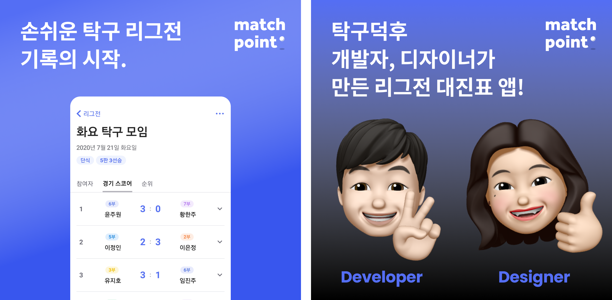
<figcaption>홍보를 위해 만들어 본 SNS 이미지</figcaption>

# 8월

## Figma 플러그인을 만들다
'Copy as PNG@2x'라는 이름의 Figma 플러그인을 만들어서 오픈했었다. 프레임을 선택한 후, 플러그인을 실행하면, 브라우저가 열리면서 프레임을 두 배 크기의 PNG 이미지로 클립보드에 복사해 주는 플러그인이었다. Figma에서 쉽게 프레임 이미지를 2x로 클립보드에 복사하는 기능이 없었다. 1x로 복사하는 기능을 쓰면 Notion이나 Slack에 이미지를 공유하면 당연하게도 레티나에선 늘 깨져 보였다. 그래서 만들게 되었다. 기능 기획을 내가 하고, 개발은 매치포인트를 만든 개발자가 해주셨다.

처음 오픈하고 나서 사용자 수가 생각보다 빠르게 늘었다. 홍보도 열심히 하지 않았는데 자연스럽게 유입된 사용자들이 대부분이었다. 우리나라보다는 러시아, 남아공, 미국, 두바이 등 다른 나라에서 더 많이 사용했다.

아쉽게도 현재는 이용할 수 없다. Figma에 10월쯤 갑자기 이 기능을 만들어서 배포했고, 어떻게 할까 고민하다가 플러그인을 종료하기로 했다. 아쉽게 종료했지만, 플러그인을 만들어 보는 경험 자체는 재밌었다. 나중에 한 번 이 과정을 글로 정리해봐야겠다.

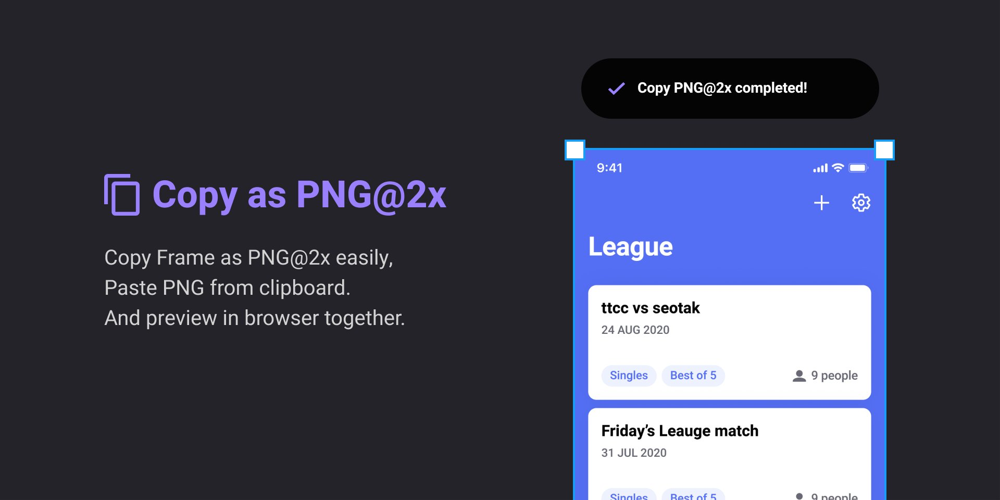
<figcaption>지금은 문을 닫은 비운의 Figma 플러그인</figcaption>

# 9월

## &lt;주니어 디자이너를 위한 프로덕트 디자인 A to Z&gt; 강의 시작
Wanted에서 주니어 디자이너를 위한 강의를 했다. 혼자 해 보는 첫 강의였다. 준비하는 과정이 정말 쉽지 않았다. 먼저 블로그 글 한 개 분량의 내용을 작성했다. 자료 조사도 해야 하고, 내용의 체계도 갖춰야 하므로 내용을 작성하는 일이 제일 오래 걸렸다. 이를 기반으로 슬라이드를 만들고, 강의 리허설하며 얼마나 시간이 걸리는지를 체크하고 조정한다. 이렇게 6주 차 준비를 일 끝나고 평일 저녁이나 주말 내내 준비했다. 그나마 10월에 추석이 있어서 다행이었다. 비록 추석 때 본가에는 못 갔지만, 그 시간이 없었으면 강의를 순조롭게 마무리할 수 없었을 것이다.

<figcaption>wanted의 아름다운 강의실에서</figcaption>

## 📘 9월에 읽은 책

- [나만의 콘텐츠 만드는 법](http://www.yes24.com/Product/Goods/91558474)

# 10월

## 아름다운 석촌 호수를 매주 즐기던 10월
추석이 있는 주를 제외하고, 매주 토요일 아침, wanted 사무실이 있는 롯데월드 타워에서 강의를 하느라 잠실에 갔었다. 처음엔 아침 강의라서 부담스럽고, 힘들 거라고 막연하게 생각했었는데 생각보다 내가 아침형 인간이었는지 아침 시간에 하는 강의가 내게 잘 맞았다. 게다가 아침 강의를 끝내고 점심을 먹고 석촌 호수 근처에 있는 카페에 앉아 계절을 느낄 때면 너무 행복했다. 물론, 다시 강의를 준비하러 집으로 가긴 해야 했지만.

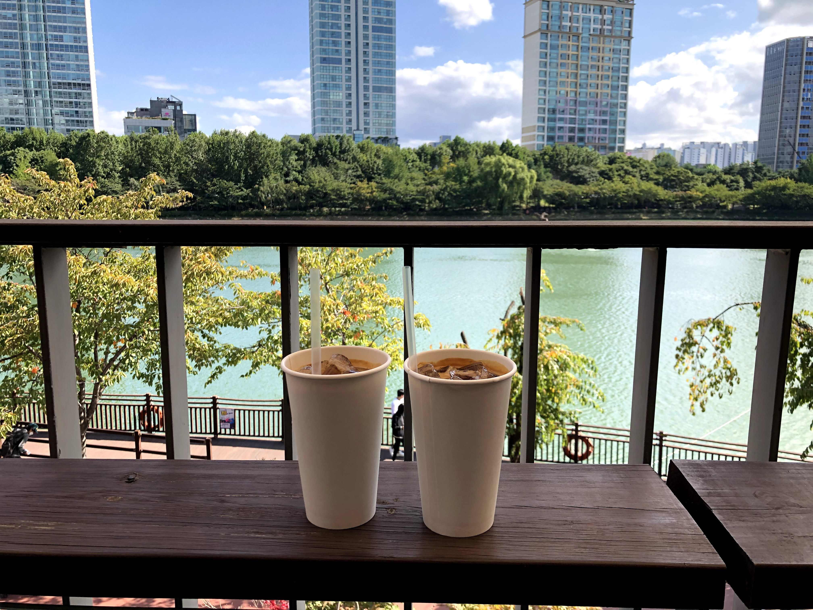
<figcaption>단풍이 지지 않았던 초가을날 점심</figcaption>

<figcaption>강의가 끝나던 날, 단풍이 진 석촌호수 근처</figcaption>

## 📘 10월에 읽은 책

- [기록의 쓸모](https://select.ridibooks.com/book/2639000033)
- [규칙없음](https://ridibooks.com/books/510001020)

# 11월

## Manta iOS, Android 앱 런칭
글로벌 웹툰 구독 서비스 앱 'Manta'를 런칭했다. 이 프로젝트를 통해 세 가지 새로운 경험을 했다. 첫째, 목적 조직으로 처음 일을 해보게 되었다. 사이드 프로젝트를 포함하면 온전히 처음은 아니겠지만 RIDI에서는 처음이었다. 하나의 목적을 갖고, 그 목적 아래 모인 이해 관계자들과 밀접하게 일하는 경험은 내게 잘 맞았다. 그래서 앞으로 이직하게 되면, 기능 조직보다는 목적 조직이 주인 곳에서 일하고 싶다고 생각하게 되었다. 둘째, 구독 서비스를 처음 밀접하게 다뤄보게 되었다. 가끔 리디셀렉트 작업을 했지만 주된 업무는 아니었기 때문에, 구독 도메인은 멀리서나마 간접적으로 경험해 본 게 다였다. Manta에서 구독 서비스에 대한 지식을 쌓아볼 수 있었다. 셋째, 영어로 디자인하기. 글로벌 서비스로서 첫 타깃 시장인 미국 시장 진출을 위해 앱은 영어로 디자인이 되었다. 나름 영어 공부를 좋아하는 사람인데도 영어로 디자인하는 건 쉽지만은 않았다. 뉘앙스를 파악하기 어려울 때가 제일 많았던 것 같다. 그래도 많은 레퍼런스를 보며 제일 내가 의도한 기능에 어울리는 레이블이나 문장을 쓰기 위해 노력했던 게 좋은 기억으로 남아있다.
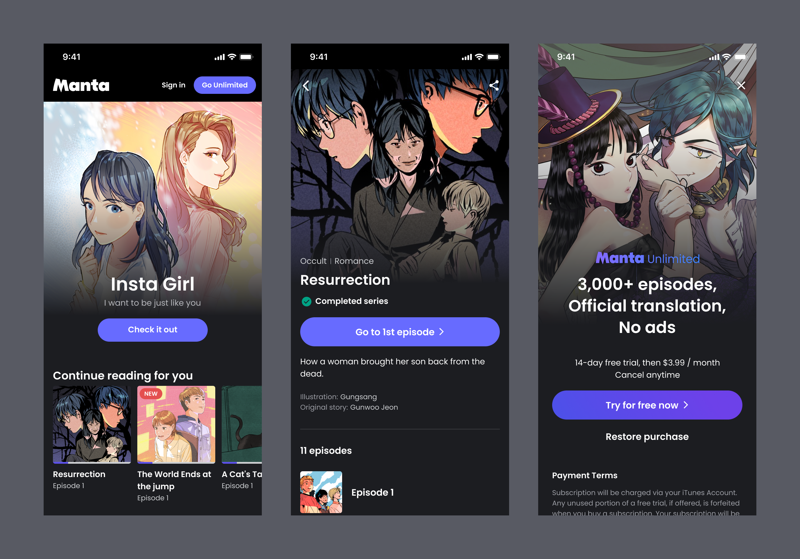
<figcaption>RIDI의 첫 글로벌 웹툰 구독 서비스, Manta Comics</figcaption>

# 12월

## 퇴사
5년 6개월 다닌 회사를 퇴사하게 되었다. 새로운 도메인, 새로운 조직을 경험해 보고 싶다는 생각이 퇴사하게 된 가장 큰 배경이었다. 초반엔 시간이 빠르게 흘러서 길다고 느끼지 않았지만, 5년이 넘으면서 IT 업계에서 5년이 넘는 시간은 생각보다 긴 시간처럼 느껴졌다. 그래서 퇴사를 결심했다. 주변을 보면 환승 이직을 많이 하는데, 전 회사까지 포함하면 거의 7년 만에 쉬는 거라 바로 이직하고 싶지 않았다. 한 달은 푹 쉬고, 이후에 여러 사람을 만나면서 이야기를 나누고, 천천히 이직을 준비하고 싶었다. 하지만 쉬면서 &lt;내가 뭘 했다고 번아웃일까요&gt; 책을 읽으며 내가 번아웃이라는 사실을 알게 되었다. 책 제목처럼 정말 '내가 뭘 했다고 번아웃일까'라고 생각하기도 했지만, 내 상태를 받아들이기로 했다. 서두에 밝힌 것처럼 퇴사 후 휴식하면서 어느 정도 번아웃을 조금씩 벗어났고, 이제 이직 준비를 진행하고 있다.

## 📘 12월에 읽은 책

- [일 잘하는 사람은 단순하게 합니다](https://ridibooks.com/books/754025781)
- [내가 뭘 했다고 번아웃일까요](https://ridibooks.com/books/754030105)
- [어린이라는 세계](http://www.yes24.com/Product/Goods/94978691)

# 마치며
2020년에는 정말 다양한 일들이 많았다. 코로나 때문에 업무적으로는 갑자기 원격 근무를 전일 하기도 했고, 조직을 옮기고 처음부터 서비스를 만들어보는 경험도 했고 퇴사도 했다. 사이드로는 프로젝트를 두 개나 배포했었고 강의도 했다. 업무 외적으로는 첫 전세 계약을 하며 어른이 된 기분을 느끼기도 했다. 2020년 같은 다이나믹한 해가 또 있을까 싶다.

올해는 어떤 일이 일어나게 될까. 내 손에 모든 게 달렸지만, 아무쪼록 평범하게 살아내는 나날이 되었으면 좋겠다.
