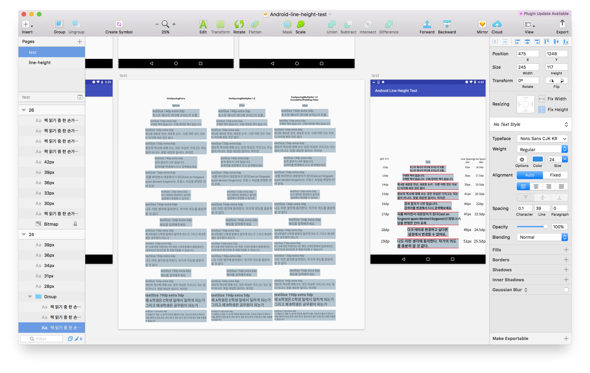

# 낯선 Android OS 버전과 친해지기.

iOS 기기를 쓰는 UI 디자이너들이 많다. 나 조차도 iPhone, iPad 등 주로 iOS 기기만 평소에 사용한다. 그렇다보니 Android 자체가 익숙하지 않을 때가 종종 있다. 하지만 국내 스마트폰 OS 점유율은 Android가 70% 이상이다.[^1] 전년도에 비해 줄어들은 수치임에도 불구하고 국내 사용자의 대부분은 Android를 사용한다. Android 기기도 몇개 가지고 있지만 주력으로 쓰지 않기 때문에 Android 지식에 뒤쳐질 때가 종종 있고 낯설게 느껴질 때가 있다.
그 중에서도 Android 버전은 iOS 버전보다는 상당히 낯설다. 알파벳 순서대로 디저트 이름을 버전명으로 사용하는 정도만 아는 분들도 있으리라 생각된다. [^2]

[^1]: 2017년 4월 Kisa 자료를 바탕으로 적은 수치.
[^2]: 왜 디저트 이름을 사용하는지 공식적으로 알려져있지는 않다.

## 디저트 이름과 더불어 API 숫자도 같이 파악하자.

* Nougat나 Marshmallow 등 Android OS별 디저트 버전명이 있지만 OS 안에서도 버전이 나뉜다. 그 나눠진 버전에 숫자를 매긴 것이 API 번호이다.
* 컴포넌트의 도입 시기 및 커버할 수 있는 정확한 API 번호를 알아야 적용할 수 있는 컴포넌트인지를 알 수 있다.
  * 예를 들어, AnimatedVectorDrawable을 써서 애니메이션을 만들고 싶다고 가정해보자. 이 클래스는 API level 21부터 추가되었다. 이때 우리 제품이 API 18부터 지원하고 있다면? 하위 버전에서는 제대로 동작하지 않을 가능성이 크다. 모든 API를 한 번에 대응하려면 해당 클래스를 사용하기는 어렵다.
  * iOS에 비해 Android는 하위 버전 사용자가 꽤 있어서 쉽게 하위 버전을 버리지 못한다.[^3]
    * Marshmallow(23) 가 **30.9%**, 그 뒤로 Lollipop(21) 6.4%, (22) 20.8% **총 27.2%**, Nougat(24) 17.6%, (25) 3.0% **총 20.6%**, Kitkat(19) **13.8%**, Jelly Bean(16) 2.2%, (17) 3.1%, 18(0.9%) **총 6.2%** 를 차지하고 있다. [^4]
  * Material Design 가이드를 최대한 따르고 싶지만 Lollipop 이전 버전에서는 Material의 기본 컴포넌트를 사용하기 어렵다.
    * 이 이유 때문에 Material Design 인듯 컴포넌트를 만든 적이 몇번 있다.
    * ~~Material Design은 그림의 떡~~

그렇기 때문에 디자인 하고 있는 앱에서 각 기기마다 어떤 버전부터 지원하고 있는지 기억해놓으면 좋다. 자세한 내용은 [위키백과의 안드로이드 버전 역사](https://ko.wikipedia.org/wiki/%EC%95%88%EB%93%9C%EB%A1%9C%EC%9D%B4%EB%93%9C_%EB%B2%84%EC%A0%84_%EC%97%AD%EC%82%AC), [Android - 기록](https://www.android.com/history/) 페이지 참고.

# 개발자와 디자이너가 다른 단위를 사용하는 Android의 행간

서비스에서 작지만 놓치기 쉬운 부분은 `행간`이 아닐까 생각해본다. 그나마 글자 크기, 아이콘 width, height, 이미지 사이의 여백 등은 dp로 개발자한테 전달할 수 있고 기본으로 들어있는 수치가 있지 않은 이상 기대한 대로 나오는 편이다. 하지만 행간은 의도한 대로 표현하기 어렵다. dp로 전달하기 어렵기 때문이다. 일단 Sketch에서 사용하는 수치와 단위가 다르다. Android 레이아웃 XML에서 행간을 어떻게 구현하는지 살펴보면 왜 그런지 알 수 있다. 일단 Android 레이아웃은 무엇일까?

##  Android Layout

> 레이아웃은 사용자 인터페이스에 대한 시각적 구조를 정의합니다. (...)
> 레이아웃을 선언하는 데에는 다음과 같은 두 가지 방법이 있습니다.
>
> 1. UI 요소를 XML로 선언.
> 2. 런타임에 레이아웃 요소 인스턴스화. [^5]

레이아웃은 아시다시피 시각적 구조이고 레이아웃을 만드는 데 두 가지 방법이 있다. 이 중에서 첫 번째 방법, Android XML에서 행간을 구현하는 방법을 알아보려고 한다. (두 번째는 뭔지 감도 안 온다... 모른다 개발 용어…) XML을 사용하면 HTML로 웹 페이지를 디자인하듯 작성할 수 있다. 그래서 HTML를 조금이라도 다룰 줄 아는 디자이너라면 어떤 구조로 되어있는지 알 수 있을 것이다.

## Android XML에서 행간을 어떻게 구현할까

XML이 뭔지 대충 알았으니 이제 Android에서 행간을 줄 때 사용하는 속성들을 알아보자. 첫 번째는 `lineSpacingExtra` 이다. `Extra` 를 사용할 때는 문장 사이 간격을 몇 dp로 할지 정확한 수치를 입력해주면 된다. 하지만 여기서 문제점은 폰트마다 글자 크기 마다 한 문장의 높이가 어느정도 되는지 예상하기 어렵다는 점이다. 그래서 수치를 의도할 수는 있지만 실제로 어떻게 화면에 보일지 디자이너는 알기 어렵다. 또 고정된 수치이기 때문에 글자 크기에 따라서 한 수치를 사용하는 것은 자연스러워 보이지 않을 수 있다.

`Multiplier`는 배수로 입력해주는 것이다. 글자 크기에 따라서 알아서 늘어나기 때문에 괜찮은 수치를 찾아서 모든 TextView에 적용해주는 것도 고려해볼만하다.[^6] 하지만 Extra와 마찬가지로 폰트마다 글자 크기 마다 한 문장의 Height를 정확하게 디자이너가 알기란 어렵다. 또 TextView에는 디폴트로 여백이 들어간다.

그래서 `includeFontPadding="false"` 라는 속성이 있다. 말 그대로 폰트의 Padding을 없애주는 것이다. Android Developer에서는 이렇게 소개하고 있다.

> Leave enough room for ascenders and descenders instead of using the font ascent and descent strictly. (Normally true).

사실 한글에는 Ascender와 Descender가 없다. ~~한국에서 만든 앱이라고 한글만 쓰는 건 아니지만…~~ 어쨌든 기본적으로 들어있는 여백을 해당 속성으로 제거할 수 있다. 하지만 얼마나 여백을 제거해주는지도 디자이너가 알기 어렵다. 그래서 간단하게(?) TextView를 만들어서 테스트해봤다.

<figcaption>Test App을 빌드하여 스크린샷을 촬영하여 Sketch에 모은 모습.</figcaption>

## 테스트 과정

lineSpacing 에 따라서 TextView의 높이도 달라지기 때문에 시각적으로 알 수 있게 배경색을 추가하였다. 자주 쓰는 글자 크기 x lineSpacingMultiplier 값들을 모두 스크린샷으로 촬영했다. lineSpacingExtra는 테스트하지 않았는데 그 이유는 위에서 설명한 것처럼 이 값은 절대 값이라 폰트 크기 마다 다르게 대응해주기 어렵다. 그래서 앞으로 `lineSpacingMultiplier` 만 사용하기로 결정하여 테스트하지 않았다. 처음에는 1.0, 1.1, 1.2, 1.3, 1.4 이렇게 소수점 첫째 자리만 변경하여 테스트하였다. 생각보다 0.1의 변화가 커서 둘째 자리까지 테스트해보았다. 그리고 `includeFontPadding`이 false일 때, true일 때도 함께 테스트했다.

## 테스트 결과

결론적으로 말하자면 테스트 이후로 우리 앱에서는 `includeFontPadding`은 default를 사용하고 추가되는 TextView나 두 줄 이상되는 TextView에만 `lineSpacingMultiplier`는 `1.15`를 사용한다. 1.15인 이유는 그게 내가 봤을 때 너무 많은 여백을 차지하지 않으면서 가독성도 그럭저럭 괜찮은 수치였다. 그래서 이 수치는 주관적임을 밝힌다. `includeFontPadding` 을 `true`로 밖에 쓸 수 없었던 이유는 해당 여백도 고려되어 margin 값이 설정되어 있기 때문이다. padding을 모두 없앨 경우, 여기저기 뒤틀어지는 사태가 발생하게 된다. 모든 TextView에 `lineSpacingMultiplier` 값을 사용할 수 없던 이유는 이 값을 사용할 경우, 하단 여백이 늘어나기 때문에 전자와 비슷하게 여기저기 뒤틀어지는 사태가 발생하기 때문이다. 그래서 일부 TextView에만 추가하기로 결정했다.

개발할 때는 저 값만 쓰면 되지만 디자인할 때 Sketch에서는 글자 크기마다 어떤 수치를 쓰면 될까? 여기서도 결론을 먼저 말하자면 어떠한 규칙도 찾을 수가 없었다. 내 예상은 **'글자 크기에 따라서 일정한 수치나 일정한 배수로 행간은 증가할 것이다'** 였다. 하지만 폰트 크기가 1dp 늘어났을 때 행간은 1dp, 2dp, 1.5dp 이런식으로 들쭉날쭉 늘어났다. TextView의 상하단 여백도 비슷했다. 그래도 상하단 여백은 대체로 3dp 정도라고 가정할 수 있었다. [^7] 그래서 미리 글자 크기 별로, 빌드한 앱의 스크린샷을 기반으로 행간을 다르게 Text 박스를 미리 만들어놓고 표로 만들어서 수치를 참고해서 디자인을 하고 있다.

# 마치며

디자이너가 이런 개발 영역까지 알아야되냐는 이야기를 할지도 모른다. 개인적인 생각은 몰라도 되고 알고 싶으면 알면 된다고 생각한다. 디자이너의 역할과 스펙트럼이 넓어지면서 다양한 특성과 역할을 가진 디자이너가 나타나는 시대라고 생각한다. 나 같은 경우 개발을 취미로 공부하는 타입의 디자이너이다. 내가 기획한 무언가를 만들고 그게 제대로 돌아가는 게 신기하고 재밌다. 그래서 더 알고 싶어서 더 공부하는 케이스다. 각자 특성에 맞춰서 더 좋아하는 영역을 발전시키는 건 나쁘지 않다고 생각한다.

개인적인 흥미로 공부했지만 개인적인 기쁨과 더불어 개발자 분들과의 소통에도 어느정도 긍정적인 영향을 주었다고 생각한다. API 버전에 대해서 알고 나서는 Material Design에서 사용하는 컴포넌트를 우리 앱에서는 쉽게 적용할 수 없는 이유를 알았다. 행간과 관련해서는 의도한 대로 디자인이 나오지 않는 이유를 알게 되었다.

디자이너로서 볼 때 API 버전을 알면 원하는 컴포넌트를 사용하기 위한 다른 방법을 미련 없이(?) 찾게 된다. 행간이 구현되는 방식은 알았지만 아직 Sketch에서 효율적으로 입력할 방법도 찾지 못했다. 테스트를 통해 어떠한 규칙도 찾지 못했기 때문이다. 하지만 막연하던 Android XML TextView에 대한 궁금증을 해소했고 매직 넘버들도 찾았기 때문에 이제 의도대로 디자인을 할 수 있다. 또 의도대로 디자인이 나오지 않는 이유를 알았기 때문에 개발자 분들과의 소통에도 도움이 되었다. (~~고 믿고 싶다.~~)

[^3]: 그렇다고 해서 업데이트를 잘 하는 iOS에서 하위 버전을 버리는 것도 쉬운 일은 아닐 것이다.
[^4]: 2017년 11월 9일까지 7일동안 수집된 데이터 [Android Developers - Dashboards](https://developer.android.com/about/dashboards/index.html?hl=ko) 참고
[^5]: [Android Developers - Layout](https://developer.android.com/guide/topics/ui/declaring-layout.html) 참고
[^6]: 기존에 개발되어 있는 상태라면 모든 TextView에 적용할 경우 여기저기 난리가 날 가능성이 크다.
[^7]: Sketch Text 박스 기준이 아닌, 글자 최하단부터의 여백이며 `includeFontPadding`은 `true`일 때다.