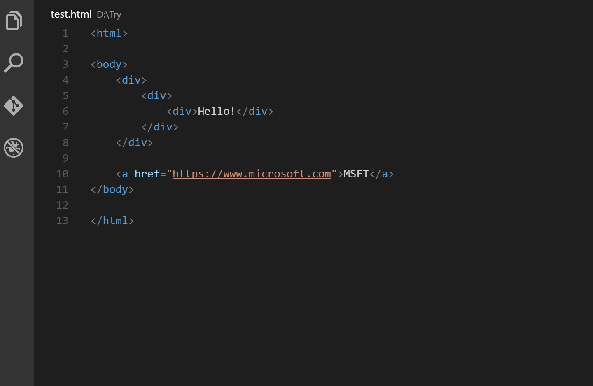

Auto Rename Tag
https://marketplace.visualstudio.com/items?itemName=formulahendry.auto-rename-tag

Bracket Pair Colorizer 2
https://marketplace.visualstudio.com/items?itemName=CoenraadS.bracket-pair-colorizer-2

Color Highlight
https://marketplace.visualstudio.com/items?itemName=naumovs.color-highlight

CSS Peek
https://marketplace.visualstudio.com/items?itemName=pranaygp.vscode-css-peek
https://github.com/pranaygp/vscode-css-peek/raw/master/readme/working.gif

HTML CSS Support
https://marketplace.visualstudio.com/items?itemName=ecmel.vscode-html-css

HTML to CSS autocompletion
https://marketplace.visualstudio.com/items?itemName=solnurkarim.html-to-css-autocompletion

Live Sass Compiler
https://marketplace.visualstudio.com/items?itemName=ritwickdey.live-sass

Live Server
https://marketplace.visualstudio.com/items?itemName=ritwickdey.LiveServer

Material Icon Theme
https://marketplace.visualstudio.com/items?itemName=PKief.material-icon-theme

Material Theme
https://marketplace.visualstudio.com/items?itemName=Equinusocio.vsc-material-theme

Prettier - Code formatter
https://marketplace.visualstudio.com/items?itemName=esbenp.prettier-vscode

Quokka.js
https://marketplace.visualstudio.com/items?itemName=WallabyJs.quokka-vscode