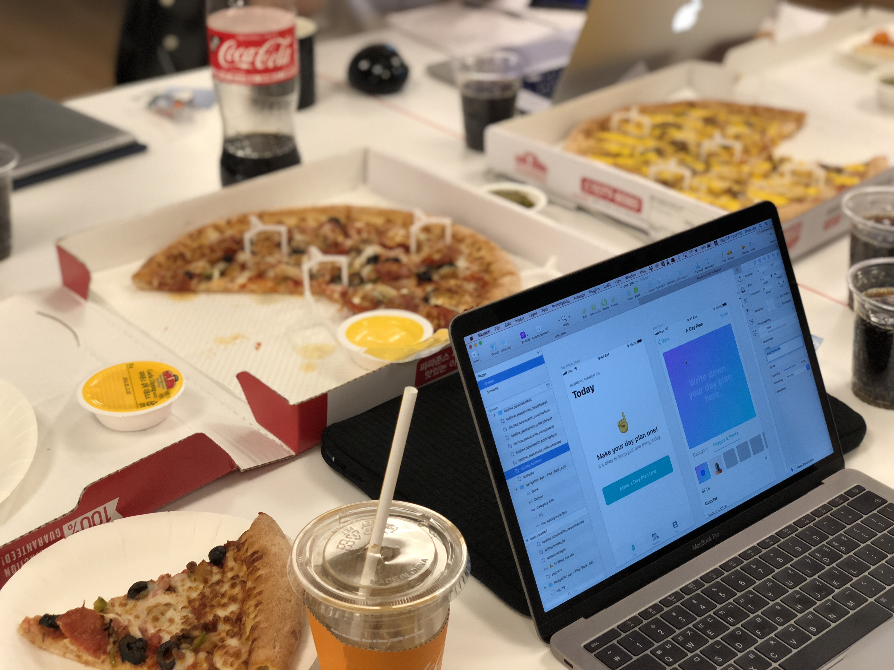
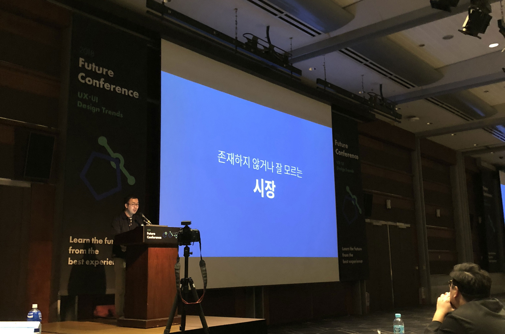
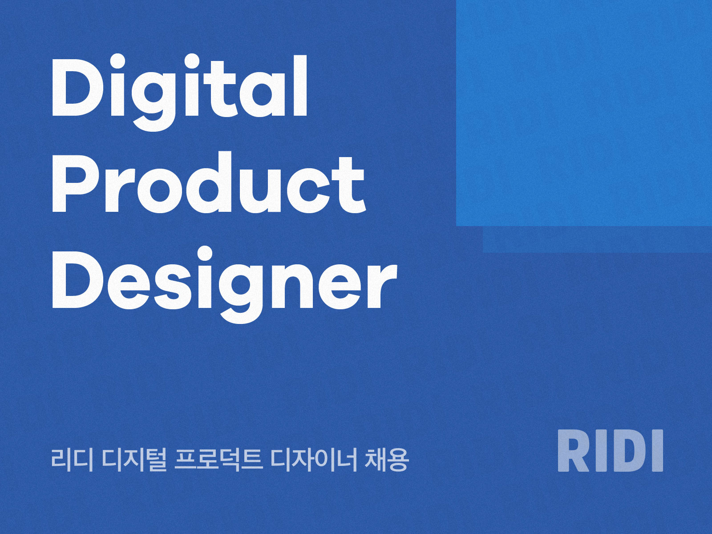
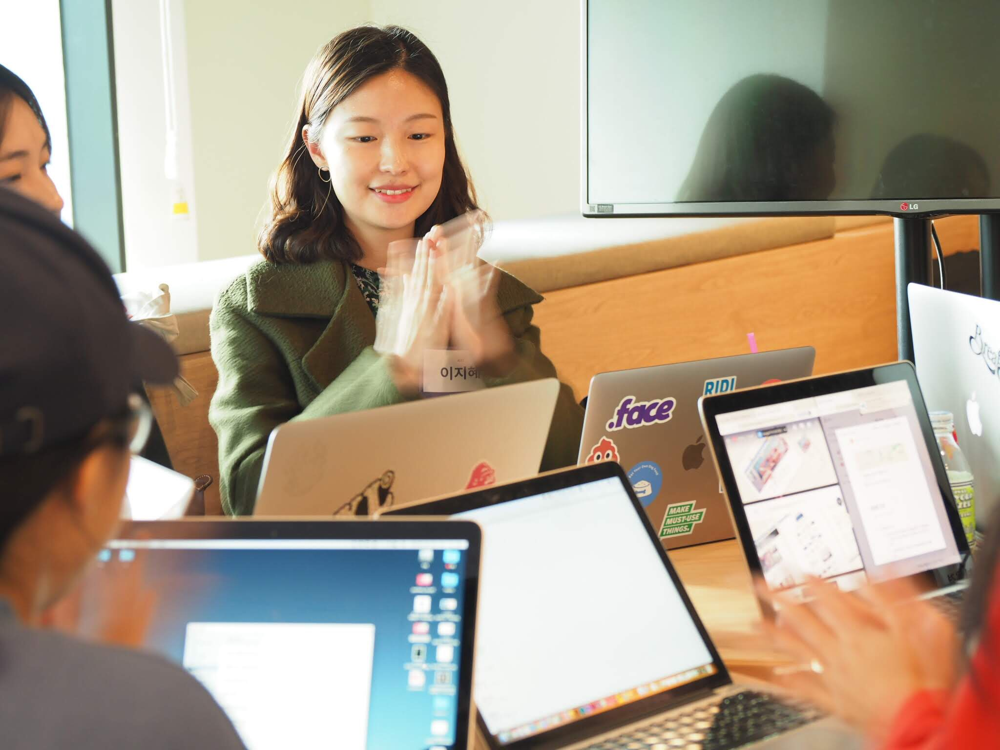
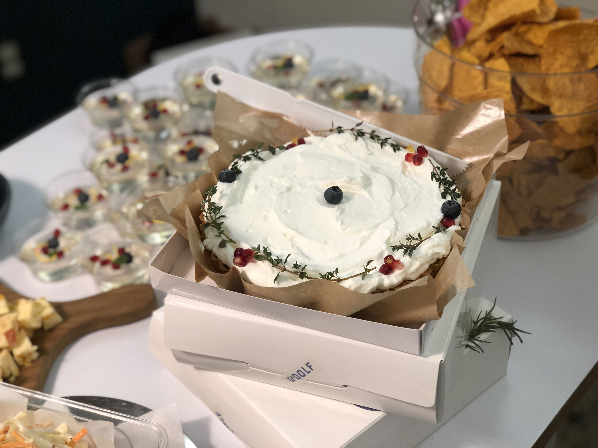

# 1월

## 📚 스터디 진행

- 디자이너도 만드는 지킬 블로그 스터디를 1-2월 동안 진행했다.
  - 굉장히 소규모로 진행했던 스터디. 지킬 블로그 글을 작성할 때 굉장히 많은 도움이 되었다. 스터디 2기를 하기 위해 모집도 했었는데 너무 바빠져서 진행하지 못했다. 2019년에는 꼭 진행해보고 싶은데 지킬을 다 까먹은 것 같기도(...)

## 📻 팟캐스트 출연

- 디자이너의 일과 삶을 다루는 팟캐스트 `Design Table` ['끊임없이 배우는 디자이너' 🔗](https://www.designspectrum.org/designtable-s1e19) 편에 게스트로 출연했다.
  - 디자이너로서 내 삶을 반추해볼 수 있던 기회였다. 생각보다 많은 분들이 잘 들었다고 말해주셔서 몸 둘 바를 몰랐다. 사실 녹음한 날에는 말을 잘 못 하는 자신을 자책했다. 내 얘기라서 당연히 자연스럽게 할 줄 알았는데 긴장에 취약한 나는 그런 부류의 사람이 아니었다. 연초부터 새로운 일에 도전해서 좋았다. 

# 3월

## 👩‍💻 해커톤 참여

- Startup Weekend Women Edition에 참가했다.

  - 대학교 4학년 때 이후로 정말 오랜만에 해커톤에 참여했다. 이제 밤새는 건 힘들어서 밤을 새우지 않는 1박 2일 해커톤에 참여했다. 뭐든 열심히 하려는 성격이다 보니 해커톤 하는 동안 조금 스트레스를 많이 받기도 했다. 지금 생각해보면 즐기면서 할 걸 후회가 된다. 하나의 서비스를 처음부터 만든다는 건 정말 대단한 일임이 틀림없다.

[dribbble에서 보기 🏀](https://dribbble.com/shots/4389324-One-plan-for-one-day) 

## ✍️ 글쓰기

- 디자이너도 만드는 Jekyll Blog - 마지막 편 '본격적으로 Jekyll Theme 커스터마이징하기' 글을 올렸다.
  - 나름대로 연재한 글이었는데 마무리를 해냈다. 최근에 스포카 디자인 팀에서 지킬 블로그를 만들 때 이 시리즈를 참고해주셨다고 말해주셔서 더 기뻤다!

[본격적으로 Jekyll Theme 커스터마이징하기 🔗](http://jihyeleee.com/blog/third-designer-can-make-jekyll-blog/)

# 5월

## ✍️ 글쓰기

- 블로그에 `Coming Soon` 태그를 만들고 이미지 멋지게 형광펜 공유하기 draft를 올렸다.
  - 아직도 draft 상태라니 😱 계속 쓰고 있긴 한데 진도가 안 나간다. 반성해야겠다. 너무 잘 쓰려고 하지 말고 대충이라도 써서 올리자.

[이미지로 멋지게 형광펜 공유하기 draft 🔗](http://jihyeleee.com/project/highlight-img-share/?fbclid=IwAR15H58VZTk1ram2_euzrxWS4z0mEdjXXxg1JAknDNiLXQJ9zS0TU0jTKK4)

[dribbble에서 보기 🏀](https://dribbble.com/shots/4407823-Here-s-Coming-Soon-Message-for-Post-Draft)

# 6월

## 👀 디자인 행사가기

- [비핸스 포트폴리오 리뷰 서울 2018](https://www.designspectrum.org/spectrumday-e11) 행사에 다녀왔다.
  - 다른 분들은 어떻게 포트폴리오를 만드는지 궁금해서 신청했었다. 제일 기억에 남았던 말은 '여성으로서 자기 검열은 그만하고 나가서 이야기하자!'라는 영화 님의 말이었다. 그래서 그다음 달, 7월 스펙트럼 데이에 발표하기로 결심하게 되었다. 작업물을 공유하는 매체로 사람들이 많이 쓰는 인스타그램을 활용하는 현규 님의 이야기도 좋았다. 2019년에는 인스타그램을 활용해봐야지.

# 7월

## 💼 포트폴리오 리뷰 코치로 참여

- 원티드 UX/UI 디자이너 1:1 커리어 코칭 행사에 참여했다.
  - 나의 첫 포트폴리오 리뷰 행사! 이를 계기로 10월부터 [Wanted 온라인 포트폴리오 코치](https://www.wanted.co.kr/wd/15952)로도 활동하고 있다. 생각보다 코치로서 적성이 맞아서 재밌게 할 수 있었다. 코칭을 받으신 분들도 만족하셨다고 들어서 굉장히 뿌듯했다.

## 💪 발표

- 스펙트럼 데이에 [Lifestyle & Tech](https://www.designspectrum.org/spectrumday-e12)를 주제로 발표했다.
  - 2014년 이후로 정말 오랜만에 외부에서 한 발표였다. 더 열심히 준비할 걸 후회가 많았다. 앞으로는 무조건 스크립트를 외워서 발표해야지. 그리고 발표 리허설은 다양한 사람들 앞에서 최대한 많이 할수록 좋다. 이런 깨달음, 인사이트를 글로 정리해보고 있다. (언제 올릴지는...)

[MAKE MUST-USE THINGS. 🔗](http://www.ridicorp.com/slides/make-must-use-things/?fbclid=IwAR0MHXkTsiACkYZEtraLeKdX2d7AHsGGPlq7PI9hFG_3feFHjJTlH9NegNA)

## ✍️ 글쓰기

- 최근 읽은 콘텐츠 7월 편을 처음으로 업로드했다.
  - 쉼 없이 레퍼런스와 아티클을 찾아서 인스타페이퍼(Instapaper) 쌓기를 좋아한다. 쌓기만 하다 보니 어떤 구절에서 어떤 인사이트를 얻었는지는 기억하기 어려웠다. 그래서 하나의 글로 모아서 어떤 구절에서 어떤 인사이트를 얻었는지 적으면 좋겠다는 생각을 했다. 돌이켜 보니 귀찮기는 하지만 그냥 인스타페이퍼에 쌓는 것보단 훨씬 좋은 것 같다.

[최근 읽은 콘텐츠 - 2018 July 🔗](http://jihyeleee.com/blog/july-recent-article-i-read/?fbclid=IwAR26ZvMh-Mljke-bogj2qYrM0_QJd7l0ScQhoMh2NjuLNUFjxoVDBLTSON4)

# 8월

## ✍️ 글쓰기

- 리디 기술 블로그에 '리디북스 PAPER PRO UI 디자인하기' 글을 올렸다.
  - 정말 오랜만에 회사 블로그에 글을 올렸다. [리디북스 형광펜 뷰어 개선 후기](https://www.ridicorp.com/blog/2016/11/10/highlight/) 이후로 2년만이다. 2017년 하반기 동안 열심히 PAPER PRO 런칭을 준비했다. 그래서 PAPER PRO 디자인 글을 쓴다면 업로드 시기가 늦어지면 안 될 것 같다는 생각이 들었다. 그래서 빠르게 글을 썼다. [디자인 스펙트럼 픽](https://www.designspectrum.org/spectrumpicks-article33)에 선정되기도 했다!

[리디북스 PAPER PRO UI 디자인하기 🔗](http://www.ridicorp.com/blog/2018/08/10/paper-pro-ui-design/)

- 최근 읽은 콘텐츠 8월 편을 업로드했다.
  - 디지털 프로덕트 디자인 외에도 내가 읽고 있는 다양한 분야의 글을 올렸다.

[최근 읽은 콘텐츠 - 2018 August 🔗](http://jihyeleee.com/blog/aug-recent-article-i-read/)

# 9월

## 👀 디자인 행사가기

- [2018 Future Conference](https://www.fastcampus.co.kr/2018future/)에 다녀왔다.
  - 구글에서 UX 매니저로 일하는 Addy Lee 님의 강연, 네이버 Whale에서 UX Lead로 일하는 최지호 님의 강연, Duotone의 CEO 정다영 님 강연이 좋았다. 하지만 전반적으로 아쉬움이 남은 행사였다.

# 10월

## 💪 발표

- 리디 개발센터 스피치에서 '내 서재 & 구매 목록 개선'를 주제로 발표했다.
  - 리디북스 내 서재 & 구매 목록의 고질적인 문제를 해결한 프로젝트. 아직 개발 진행 중이라 알파가 나오면 발표 슬라이드를 올릴 예정이다.

## 👀 디자인 행사가기

- 스펙트럼 데이 [Portfolio Reviews](https://www.facebook.com/sharedesignspectrum/posts/design-spectrum-10%EC%9B%94-spectrum-day-%EC%98%88%EA%B3%A0%EC%95%88%EB%85%95%ED%95%98%EC%84%B8%EC%9A%94-%EB%94%94%EC%9E%90%EC%9D%B4%EB%84%88%EB%93%A4%EC%9D%98-%EC%A7%80%EC%86%8D%EA%B0%80%EB%8A%A5%ED%95%9C-%EC%BB%A4%EB%AE%A4%EB%8B%88%ED%8B%B0%EB%A5%BC-%EC%A7%80%ED%96%A5%ED%95%98%EB%8A%94-design-spectrum/431258420612694/) 행사에 다녀왔다.
  - 수영 님과 다흰 님의 강연에 인사이트를 많이 얻었다. 대단한 결과물을 얻으려면 대단한 노력이 필요하다는 말을 봤던 것 같은데, 수영 님과 다흰 님도 대단한 노력이 필요하지 않았을까 싶다.

## ✍️ 글쓰기

- 리디 디지털 프로덕트 디자이너 채용 공고를 작성했다.
  - Notion으로 처음 채용 공고를 작성해보았다. 생각보다 바이럴이 많이 되었다. 글이라는 도구가 주는 힘을 또 한 번 깨달았다. 뒤이어 개인적인 채용 공고도 작성할 예정이다.

[RIDI - Digital Product Designer 🔗](http://bit.ly/2qoo3wp)

# 11월

## 👀 디자인 행사가기

- 여성 기획자 컨퍼런스에 다녀왔다.
  - 기획을 잘 하고 싶어하는 디자이너로서 꼭 가고 싶었던 행사였다. 작년에 못 가서 아쉬워서 올해는 재빠르게 신청했다. 제일 인상적이었던 강연은 [띵스플로우 이수지 CEO 님의 강연](https://www.slideshare.net/2suji/18-122541423?fbclid=IwAR2Ea4jOa1NApwrPPSiwN3BYN-VWj60Wbgzc9t2LK3ekYMxfLTQdo03hHus)과 도너스 이사 장혜선 님의 강연이었다. (혜선 님 강연 자료는 내려갔다 😭)
- 스포카 스타트업 디자이너 네트워킹 파티에 다녀왔다.
  - 리디 디지털 프로덕트 디자이너 채용 홍보 겸 다녀왔다. 비슷한 환경에서 일하는 많은 디자이너분들과 즐거운 시간을 가졌다. 특히 관심 있는 주제로 조를 만들어서 얘기를 나눴던 게 좋았다. 영어 공부를 좋아하는데 디자인을 주제로 영어 회화를 하고 싶었다. 하지만 영어에 관심 있는 디자이너를 찾기는 쉽지 않았다. 페이스북에 그런 글을 올리기는 좀 쑥스럽고 지인 중에 찾기는 쉽지 않았다. 하지만 이 행사에서 영어 회화에 관심 있는 디자이너분들을 만날 수 있어서 좋았다.

## 💼 포트폴리오 리뷰 멘토로 참여

- 스포카 포트폴리오 리뷰 행사에 멘토로 참여했다.
  - 정말 뜻깊었던 행사였다. 딱 한 가지 아쉬웠던 점은 시간이 부족했다는 것뿐! 시간이 너무 빠르게 흘러갔다. 내가 주니어 디자이너였을 때도 이런 행사가 있었다면 조금 덜 헤매지 않았을까 아쉽기도 했다. 주니어 디자이너분들은 정말 열심히 살고 있었다. 오히려 주니어 디자이너분들께 많은 인사이트를 얻기도 했다. 공유했던 나름의 지식이 도움이 되었기를 바랄 뿐이다.

# 12월

## 🥂 파티 참여

- 디자인 스펙트럼 연말 파티에 참석했다.
  - 올해 두 개의 디자인 스펙트럼 행사에 참여해서 연말 파티에 초대되었다! 다양한 디자이너분들과 만날 수 있던 계기. 2019년에도 많은 기회를 놓치지 않게 노력해야겠다.

- 여성 디자이너 만찬에 참여했다.
  - 스포카 포트폴리오 리뷰 행사에서 만난 여성 디자이너분들과 함께한 만찬! 이런 만찬은 처음이어서 너무 행복했다. 앞으로도 주기적으로 만나서 다양한 이야기를 나눌 수 있으면 좋겠다.