# Overview

## 바야흐로 공유의 시대

집에서 컴퓨터만 쓰던 시절을 지나 언제 어디서든 온라인이 가능한 시대가 되었다. 사시사철 온라인이 가능해짐에 따라 언제 어디서든 디지털 콘텐츠를 공유할 수 있다.

더불어 소셜 미디어의 발달로 ‘공유하기’ 액션 자체도 익숙해졌다. 사용자는 다양한 목적을 갖고 콘텐츠를 공유한다. 운동 기록을 위해 자전거를 탄 총 시간과 경로가 표시된 지도를, 맛집을 추천하기 위해서 음식 사진을 공유한다. 좋아하는 음악 가사에 감동했을 때 이를 기록하기 위해 가사를 공유한다. 인스타그램의 등장 이후로 이런 공유 콘텐츠는 이미지의 형태를 띤다.

공유는 사업적으로도 도움을 준다. 공유는 자연스럽게 제품 홍보로 이어지기 때문이다. 그래서 앞다투어 많은 서비스에서 공유하기 기능을 만들고 보기 좋은 공유 콘텐츠를 생성할 수 있게 설계한다.

이렇듯 공유의 시대인 지금, 물론 리디북스 앱에도 책의 구절을 이미지로 공유할 수 있는 기능이 있지만 다소 공유하고 싶은 형태의 콘텐츠는 아니었다.

# Problems

## 1. 단순히 뷰어를 캡처한 문장 이미지

기존에는 형광펜이 남겨진 페이지를 시스템에서 자동으로 캡처하여 이미지로 생성해 주었다. 그래서 형광펜을 남긴 구절 외에 앞, 뒤의 다른 구절들도 의도와 상관없이 노출되곤 했다. 또 형광펜 문장을 기준으로 있는 상하좌우 여백도 중구난방이었다.

###### 기존 형광펜 문장 이미지. 형광펜을 남긴 문장 외에도 의도와 상관없이 다른 문장이 함께 이미지로 생성되며 주변 여백도 일정하지 않았다. [^1]

## 2. 이미지 기반 소셜 미디어에 적합하지 않은 공유 이미지

기존 문장 이미지는 따로 정해진 가로와 세로 길이가 없고 문장의 길이에 따라서 달라졌다. 글자 수가 적은 짧은 길이의 문장은 가로가 길고 세로가 짧은 이미지로, 글자 수가 많으면 세로로 긴 이미지가 생성되었다. 그래서 이미지 기반 소셜 미디어에서 공유하기 적합한 비율은 아니었다.

또 단순히 책을 읽는 뷰어를 캡처한 이미지라서 뷰어에 설정한 글자 크기로 문장 이미지가 만들어졌다. 그래서 작은 글자 크기로 책을 보면 문장 이미지의 글자 크기도 작기 때문에 가독성이 좋지 않았다. 디자인의 관점에서 봤을 때도 공유하고 싶은 느낌의 이미지는 아니었다.

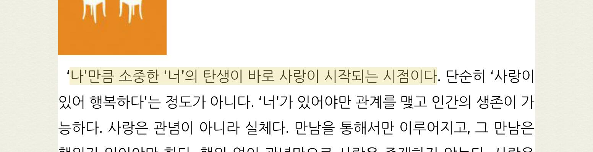

###### 글자 수가 적을 때 문장 이미지 [^2]

###### 글자 수가 많을 때 공유 이미지[^3]

## 3. 문장 외에 다른 정보가 표시되어 있지 않다.

따로 가공 없이 뷰어를 캡처한 이미지이기 때문에 어떤 책에서 나온 문장인지, 저자가 누구인지 알 수 없었다. 당연히 문장 이미지를 보고 리디북스에서 발췌한 문장인지 알 수 없었다.

# Goals

문제점을 바탕으로 아래 세 가지를 만족하는 문장 이미지 만들기를 목표로 했다.

1. 이미지 기반 소셜 미디어에 공유하기 적합한 포맷
2. 자주 공유하고 싶은 멋지고 감성적인 문장 이미지
3. 문장 외에 부가 정보도 보여주는 이미지

# Reference

우선 다른 전자책 서비스는 문장을 어떻게 공유할 수 있는지 살펴봤다. 문장을 이미지로 생성해 주는 서비스라면 그 이미지는 어떤 구조로 되어 있는지, 어떻게 공유할 수 있는지 플로도 함께 조사했다. 전자책 서비스 외에도 문장을 공유할 수 있는 다양한 서비스를 함께 조사했다.

## 전자책 서비스 Kobo, Glose

전자책 서비스 중 문장을 이미지로 공유할 수 있는 서비스는 Kobo와 Glose가 있다. 두 서비스 모두 일종의 편집 모드가 있다. 편집 모드에 진입하면 선택한 문장이 노출되고 배경 이미지, 글꼴을 바꿀 수 있다. 편집을 마친 후 공유 버튼을 누르면 공유 익스텐션이 뜨고 편집을 마친 문장 이미지를 다른 앱에 공유하거나 사진첩에 다운로드할 수 있다.

### Kobo

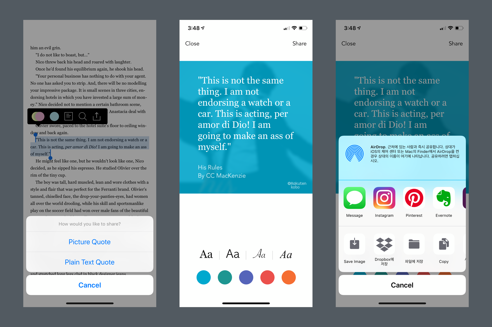

Kobo는 이미지, 플레인 텍스트 둘 중 하나를 선택해서 공유할 수 있다. 문장 이미지는 정해진 배경이 있고 배경의 컬러만 바꿀 수 있다. 총 4가지 기본 글꼴을 제공한다. 정렬은 왼쪽 정렬을 사용하고 글자 수는 대략 150자를 보여준다. 책 제목과 저자명은 왼쪽 아래에서 보여주고 오른쪽 아래에는 Kobo 로고를 표시했다.

### Glose

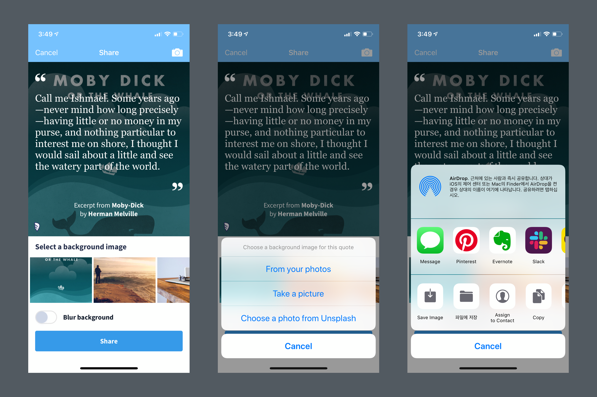

Glose는 이미지 공유만 지원한다. 문장 이미지 배경은 Glose에서 제공하는 배경을 사용하거나 커스텀 이미지를 추가할 수 있다. 바로 찍어서 해당 이미지를 사용하거나 내 사진첩에서 가져올 수 있다. 심지어 Unsplash에서 이미지를 가져올 수도 있다. 이미지가 너무 선명해서 문장이 보이지 않을 수도 있다. 그래서 blur 기능도 on/off로 제공한다.

전체적으로 가운데 정렬을 사용하고 Kobo와 마찬가지로 하단에 책 제목과 저자명을, 왼쪽 아래에는 Glose 로고를 표시했다. 큰따옴표를 위, 아래에 표시하여 인용한다는 느낌을 주었다.

## 음악 가사 공유 앱 Musixmatch

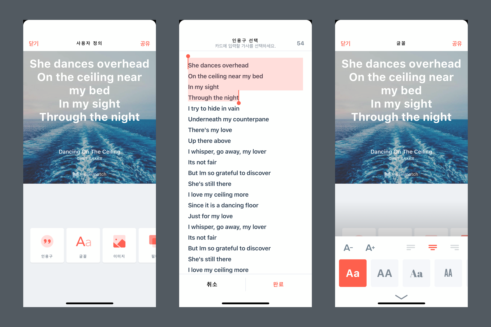

Musixmatch에는 원하는 가사를 'Lyrics Card'로 만드는 기능이 있다. 공유 이미지를 만드는 서비스 중 제일 다양한 기능을 지원한다. 글자는 글꼴을 변경할 수 있을 뿐 아니라 글자 크기, 정렬까지 변경할 수 있고 글자의 위치도 사용자가 직접 드래그로 움직여 변경할 수 있다. 배경은 제공하는 이미지 외에도 사용자가 직접 추가할 수 있고 배경의 밝기도 조정할 수 있다. 디폴트 배경이 따로 없고 매번 들어갈 때마다 배경 이미지가 변경된다. 다양한 배경을 사용하게끔 하는 디자이너의 넛지인 것 같다. 이미지 필터도 7개나 제공한다. 한 번 선택한 가사를 편집 모드에서 다시 선택할 수 있는 '인용구' 기능도 있다.

## 그 외 다양한 공유 이미지

위에 세 서비스 외에도 이미지 구조 레이아웃을 잡기 위해 다양한 공유 이미지를 살펴봤다. 어떤 이미지 비율을 사용하는지, 서비스 로고는 어떤 식으로 노출하는지, 어떤 정렬을 사용하는지, 정보는 어떤 식으로 어디에 위치시키는지 등을 조사했다.

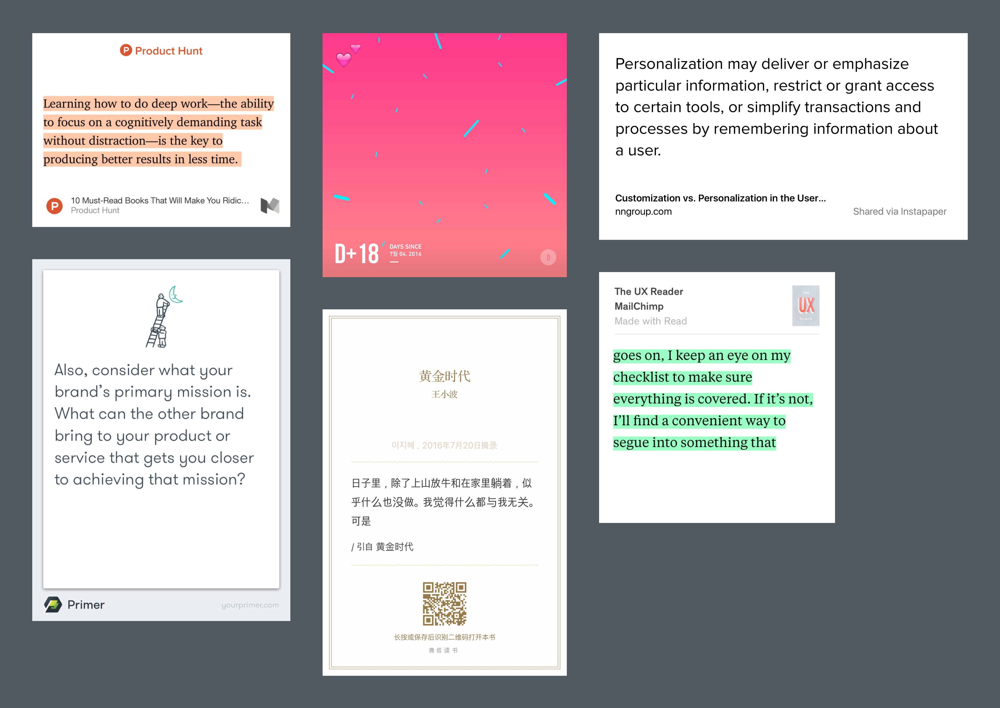

###### 왼쪽 위에서부터 medium, uniqday, instapaper, google primer, weread, read

# 본격적으로 요구사항 작성하기

## 주요 플로

주요 플로를 정리했다. 뷰어에서 문장을 선택하거나 남겨진 형광펜을 선택하면 셀렉트 메뉴가 뜬다. 해당 메뉴에서 공유 버튼을 누르면 `편집 화면`으로 이동한다. 편집 완료 후 오른쪽 상단에 공유 버튼을 누르면 완성된 공유 이미지와 공유할 수 있는 주요 소셜 미디어 리스트가 나열된 `편집 완료 화면`으로 이동한다.

편집 화면에서 사용자는 원하는 배경 이미지를 추가하거나 제공되는 이미지 중 선택할 수 있다. 글꼴과 글자색을 선택할 수 있다. 편집 완료 화면은 사실 줄이려면 줄일 수 있는 단계이다. 편집 화면에서 공유를 누르면 바로 share extension을 띄워주면 되기 때문이다. 하지만 편집이 확실히 끝났다는 느낌을 주고 싶었고, 많이 공유되는 앱을 전면에 배치해서 share extension에서 앱을 찾아야 하는 불편을 줄이고 싶었다.

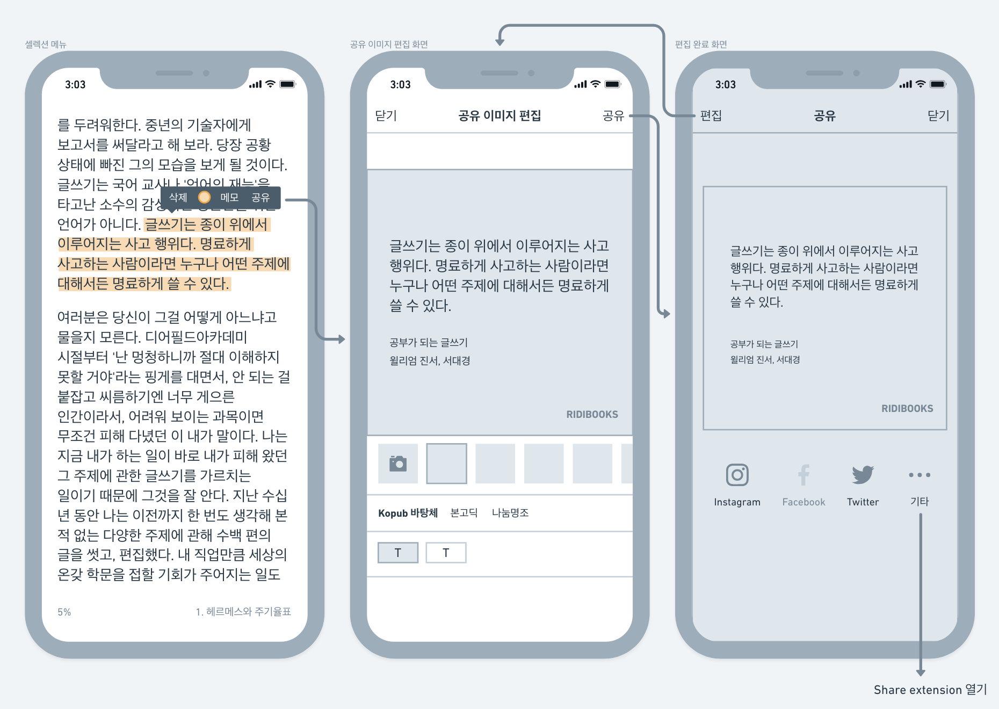

###### 플로를 정리한 와이어프레임

## 공유 이미지

### 이미지 캔버스 사이즈

기존 공유 이미지는 문제 정의에서 본 것처럼 문장 길이에 따라 이미지의 높이가 제각각이었다. 그래서 일관성을 주기 위해 정해진 넓이와 높이를 사용했다. 그리고 이미지 기반 소셜 미디어 인스타그램에서 잘 보이도록 정사각형 비율로 결정했다.

이미지의 크기는 가로, 세로 1,200px로 정했다. 너무 작으면 용량이 적어서 좋지만 xxxhdpi의 해상도를 가진 휴대폰을 고려했을 때 마냥 작게 할 수는 없었다. 소셜 미디어에 올려도 자체적으로 이미지를 다운그레이드하는 것을 막을 순 없지만, 개인 웹사이트나 블로그에 올릴 때도 공유 이미지가 아름답게 보이길 바라는 마음에서 조금 큰 크기로 정했다.

### 레이아웃 및 구조

가운데 정렬보다는 글을 더 잘 읽을 수 있는 왼쪽 정렬을 사용하기로 했다. 제일 중요한 책의 구절이 먼저 보이도록 최상단에 배치했다. 문장 아래에는 어떤 책에서 발췌한 문장인지 알 수 있게 책 제목과 저자명을 추가했고, 리디북스로 책을 읽은 구절임을 알 수 있게 로고를 오른쪽 아래에 배치했다.

구절을 상단에 고정되게 배치하고 하단에 정보를 배치하는 방식도 고민했다. (아래 레이아웃 시안 중 D안) 개인적인 취향으로는 으뜸이 시안이었다. 하지만 글자 수가 적을 경우 구절과 책 제목, 저자명 덩어리가 분리되어 시선이 분산되는 문제가 있었다. 그래서 구절과 로고를 제외한 정보를 하나의 덩어리로 묶고 자동으로 세로 가운데 정렬이 되도록 했다.

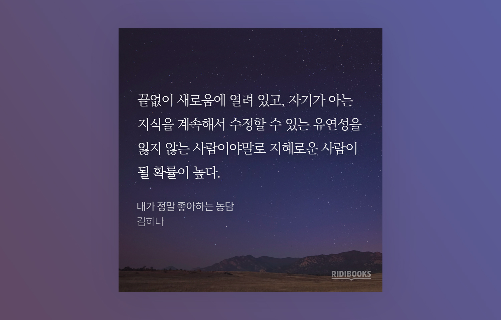

###### 최종 결정된 레이아웃 및 구조

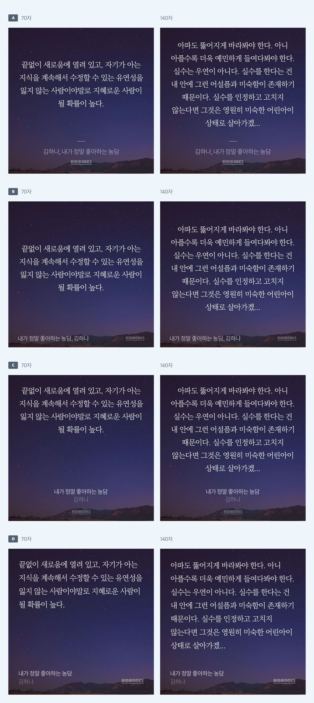

###### 정렬, 책 제목과 저자명, 리디북스 로고의 위치 등을 바꿔가며 다양한 레이아웃들을 시도해 보았다. 글자 수가 달라졌을 때도 어떤지 확인하기 위해 70자, 140자로 시안을 만들었다.

### 글자 크기와 글자 수

글자 크기는 한 가지로 고정했다. 기준은 소셜 미디어에 공유했을 때의 가독성을 고려해서 결정했다. 글자 수는 정사각형 안에서 정한 글자 크기로 최대한 많이 보여줄 수 있고, 누구나 쉽게 읽을 정도의 분량이 되도록 고민했다. 읽기 편한 분량이 트위터라고 생각해서 트위터의 글자 수도 참고했다. 그리고 최종 160자로 결정했다.

사실 160자가 그렇게 많은 글자 수는 아니다. 글자 크기를 조정하는 기능을 추가해서 더 많은 글자를 보여줄 수도 있었다. 하지만 이 기능이 많이 사용될지도 아직 증명되지 않았기 때문에 우선은 최소 스펙으로 가기로 했다.

### 글꼴과 글자색

글꼴은 Kopub 바탕체, 본고딕, 나눔명조 이렇게 총 3개로 선정했다. 모두 무료임에도 불구하고 가독성도 좋고 완성도도 높은 글꼴이라고 판단했다. 본문 글에 주로 사용되는 세리프체만 제공할까 하다가 다양성을 위해 산세리프체도 추가했다.

글자색은 총 두 가지를 제공하기로 했다. 처음에는 아예 글자색을 선택하는 옵션을 주지 않으려고 했다. 하지만 사용자가 직접 추가하는 배경 이미지의 경우, 꼭 어두운색이라는 보장이 없어서 검은색 글자색도 추가했다.

### 배경 이미지

기본으로 제공할 배경 이미지는 주로 [Unsplash](https://unsplash.com/)에서 찾았다. 단순히 배경 이미지만 찾아서 정사각형으로 자르면 되겠다고 생각했는데 막상 글자를 올려보니 가독성이 안 좋은 경우가 많았다. 이미지 내 요소가 많아서 글자가 묻히는 경우도 있었고 애매한 밝기여서 흰색, 검은색 글자가 모두 잘 안 보이는 경우도 있었다. 그래서 모든 이미지를 살펴보면서 하나씩 수정했다. 직접 그린 배경 이미지까지 포함해서 총 12개의 이미지를 선정했다.

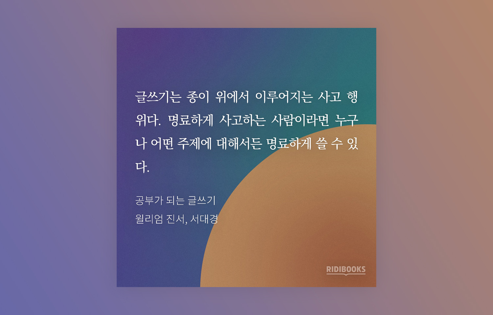

###### 직접 그린 배경 이미지

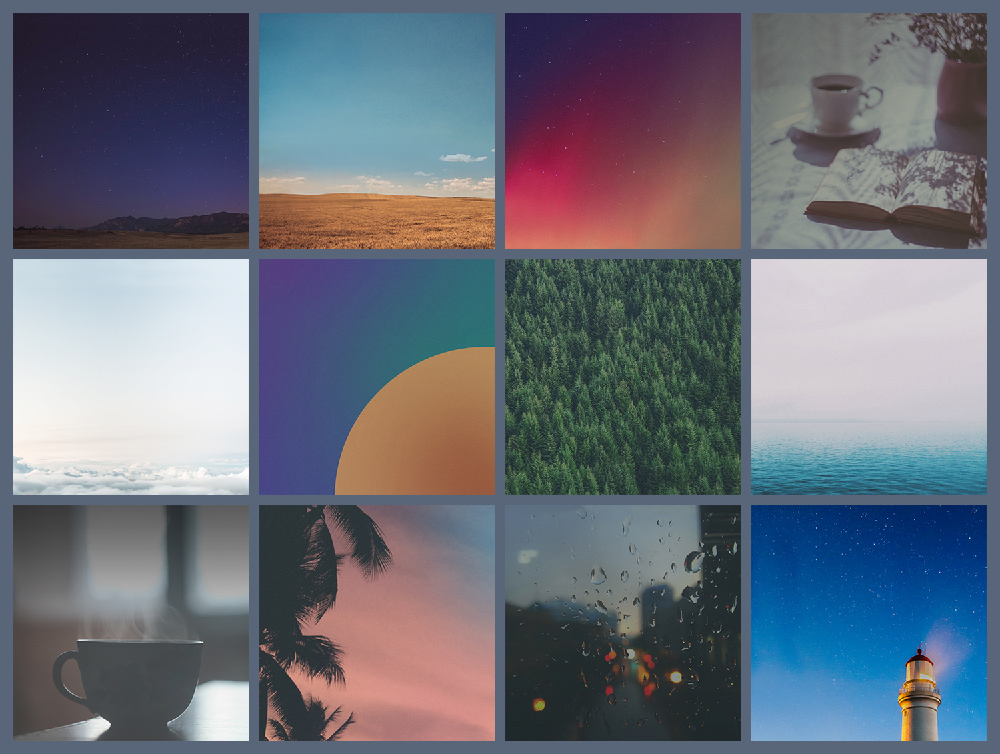

###### 최종으로 선택한 12개의 배경 이미지

### 리소스 용량 줄이기

리디북스 뷰어 내 거의 모든 기능은 오프라인에서 사용할 수 있다. 그래서 공유 기능도 오프라인에서 사용할 수 있어야 했다. 그래서 배경 이미지뿐만 아니라 글꼴도 앱에 탑재해야 해서 각각 용량을 신경 쓸 수밖에 없었다. 특히 문제는 iOS였다. iOS는 앱을 업데이트하더라도 모든 용량을 다시 다 다운로드한다. Android는 추가된 용량만 다운로드한다. 용량이 많이 늘어날 경우, iOS 사용자는 더 오래 기다려야 된다. 그래서 이미지와 글꼴 모두 최대한 용량을 줄이려고 노력했다.

# 튜토리얼

새로운 기능이 추가돼도 안내를 하지 않으면 사용자는 아예 써보지 않을 가능성이 크다. 그래서 업데이트 이후 문장 이미지 공유 기능을 적극적으로 안내했다. 튜토리얼은 앱 업데이트 이후 뷰어 진입 시 최초 한 번 뜨게 했다. 너무 많이 뜰 경우 사용자는 피로를 느낄 것이고 nngroup의 아티클[^4]에 따르면 맥락에 맞게 뜨는 게 중요하기 때문에 제일 관련이 있는 뷰어에 진입 시 뜨게 했다.  

###### 뷰어에 진입하면 뜨는 튜토리얼. 지루한 사용 영상이 되지 않게 노력했다.

# 릴리즈 후

튜토리얼로 적극적으로 안내를 하다 보니 업데이트 후 많은 피드백을 받을 수 있었다. 긍정적인 피드백도 물론 있었지만, 부정적인 피드백이 훨씬 더 눈에 띄었다.

> 블로그 공유 기능이 없어져서 불편해요. 다시 기능추가될까요?

> 기존 공유 기능은 없어지고 사진 배경으로만 공유할 수 있는 건가요? 새 기능 추가하는 건 좋지먼 왜 멀쩡하던 기능을 삭제한건지...

아차 싶었다. 문제는 플레인 텍스트를 더는 공유할 수 없다는 게 핵심이었다. 기존 공유 기능은 뷰어를 캡처한 이미지와 함께 플레인 텍스트도 공유할 수 있었다. 그런데 이미지 공유만 가능해지면서 플레인 텍스트를 공유할 수 없게 된 것이다. 개선되기 전 공유 기능 자체가 많이 사용되지 않아 내린 결정이었다 하지만 요긴하게 쓰시던 분들을 불편하게 만들어 버렸다. 그래서 Kobo처럼 공유 방식을 선택할 수 있게 중간 단계를 추가하여 문제를 빠르게 해결했다.

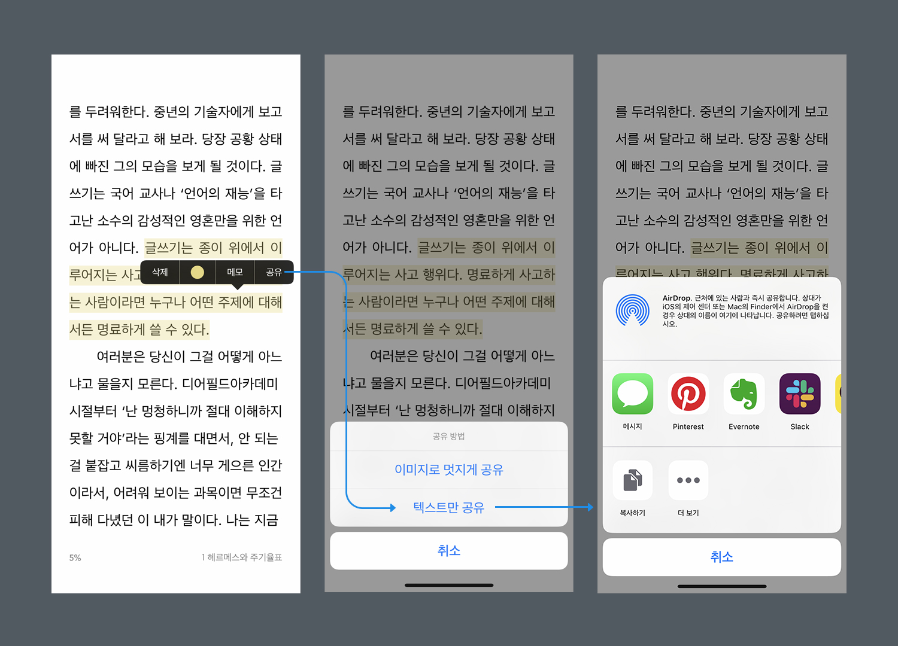

###### 첫 번째 릴리즈 이후, 사용자의 피드백을 받아서 공유 방식을 선택할 수 있는 단계를 추가하고 플레인 텍스트만 공유할 수 있는 기능을 다시 추가했다.

# 마치며

처음 이 기능을 만들 때는 주로 일반 장르 사용자분들이 많이 사용해 주실 거로 생각했다. 하지만 생각보다 장르 소설을 보시는 분들이 더 많이 사용해 주셔서 내심 놀랐다. 이렇게 감이 없어서야 싶겠지만, 어떤 아이디어든 예측한 게 들어맞을 때도 있고 틀릴 때도 있다. 그렇기 때문에 빠르게 만들고 아이디어가 괜찮은지를 확인하는 게 중요하다.

장르 소설은 대화문이 많다. 하지만 지금 이미지 공유 기능은 대화문에는 적합하지 않다. 여백이 있을 때는 모두 제거하여 한 문단으로 만들기 때문이다. 언젠가 여유가 생긴다면 대화문에 적합한 모드를 만들어 보고 싶다.

또 이 기능을 만들며 느낀 점은 역시 사용자는 디폴트 기능만 사용한다는 점이다. 음악 가사 공유 앱 Musixmatch처럼 디폴트를 계속 바꿔주는 게 필요할 것 같다. 그래야 디폴트 외에 배경 이미지, 글꼴, 글자색을 사용자분들이 사용하시지 않을까 싶다.

이 기능이 추가된 지도 벌써 약 2년이 지났다. 아직도 많은 분이 사용해 주고 계시고 지속해서 피드백을 주셔서 기쁘다. 앞으로도 이런 매력적인 기능을 만들 기회가 또 있다면 좋겠다.

[^1]: 이미지 출처 [페이스북](https://www.facebook.com/photo.php?fbid=10209678295738712&set=a.10209012739420220&type=3&theater)
[^2]: 이미지 출처 [페이스북](https://www.facebook.com/photo.php?fbid=572137429471427&set=a.474644542554050&type=3&theater)
[^3]: 이미지 출처 [페이스북](https://www.facebook.com/photo.php?fbid=764505133679922&set=a.762474363882999&type=3&theater)
[^4]: [Instructional Overlays and Coach Marks for Mobile Apps](https://www.nngroup.com/articles/mobile-instructional-overlay/)