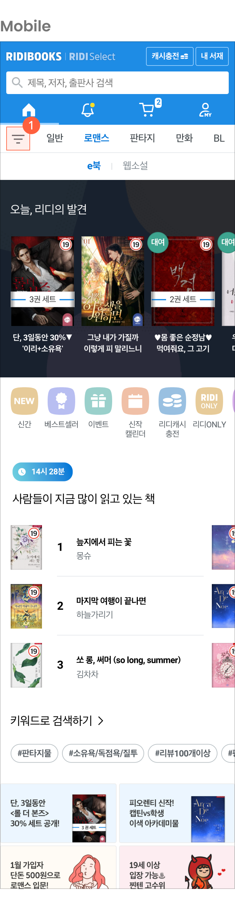

# Overview

[리디북스 서점](https://ridibooks.com/)은 전자책부터 웹툰, 웹소설까지 다양한 장르의 콘텐츠를 탐색하고 구매할 수 있는 공간이다. 특히 일반, 로맨스, 판타지, 만화, BL 모든 장르 홈은 사용자가 제일 많이 방문하는 페이지이기 때문에 리디북스에 있어서 얼굴과 같은 중요한 페이지다. 홈은 전체적인 구조를 바꾸지 않고 부분부분 개선해 왔기 때문에 크고 작은 문제들이 존재해 왔다.

# 문제

## 파편화된 서점, 파편화된 경험

이전에는 모바일과 데스크톱을 `적응형 웹`으로 따로 개발하고 있었다. 모바일은 모바일대로, 데스크톱은 데스크톱대로 최적의 디자인을 하다 보니 구조도 다르고 디자인도 많이 달랐다.

예를 들면 데스크톱에서 리디캐시 충전 페이지로 가는 링크는 우측 상단에서 바로 접근할 수 있었지만, 모바일에서는 마이리디 페이지에서 접근할 수 있었다. 오랫동안 파편화되어 온 상태여서 기존 사용자들에게는 익숙할 수 있지만 새로운 사용자에게 직관적인 구조는 아니었다.

[&lt;반응형 디자인 도입하기&gt;](http://www.yes24.com/Product/Goods/90083669) 책에 따르면, 사용자는 한 가지 작업을 완수하기 위해 장소, 상황에 따라 여러 기기를 사용한다. 예를 들면, 모바일로 지하철에서 책을 탐색하다가 구매하려고 할 때 회사에 도착해 책상에 앉는다면 모바일이 아닌 더 편한 데스크톱으로 구매를 시도할 수 있다. 그러므로 모바일, 데스크톱이든 하나의 제품이라면 최대한 같은 구조로 구성하여 사용자가 기기에 상관없이 과업을 완수할 수 있게 해야 한다. 그래서 사용성에 있어 모바일과 데스크톱의 파편화가 문제라고 판단했다.

<figcaption>모바일 서점에서는 홈 > 마이리디 > 리디캐시 충전(1번)이, 데스크톱에서는 홈 우측 상단에 리디캐시 충전(2)이 위치했다.</figcaption>

데스크톱에만 있고 모바일엔 없는 섹션도 있었다. '베스트셀러'와 '리디북스 무료책' 섹션은 로맨스 단행본[^2], 판타지 단행본, BL 단행본 데스크톱 홈에서만 노출되고 있었고, 모바일 홈에서는 노출되지 않고 있었다.

노출하는 책의 권 수가 다른 경우도 있었다. 데스크톱 '오늘, 리디의 발견'이라는 섹션 같은 경우, 5권의 책만 고정하여 노출했고, 모바일에서는 캐러셀을 사용하여 최대 20권까지 노출하고 있었다.

콘텐츠 도메인에서 S급 콘텐츠 수급은 비즈니스적으로 제일 중요한 일이다. '오늘, 리디의 발견'을 포함하여 홈의 모든 공간은 제휴를 원활하게 돕는 공간이다. 많은 출판사에서 홈에 책이 노출되길 원하고, 노출에 따라 더 좋은 책들을 수급할 기회가 늘어난다. 그래서 최대한 모바일과 데스크톱이 일관성 있게, 같은 권 수로 노출되는 게 중요했다.

<figcaption>모바일 서점에서는 캐러셀로 책을 20권까지 노출(1), 데스크톱에서는 5권의 책만 고정해서 노출하고 있었다.(2)</figcaption>

'키워드로 검색하기' 섹션 같은 경우도, 데스크톱보다 모바일에서 노출되는 키워드 수가 달랐다. 모바일에서는 기기나 화면 길이에 따라 최소 3개에서 5개 정도까지 보여주고 있었고, 데스크톱에서는 노출하고자 하는 모든 키워드를 노출하고 있었다.

## 두 번 디자인, 두 번 개발하는 비효율성

위에서 언급한 것처럼 모바일, 데스크톱 각각 최적으로 작업하다 보니 UI 디자인도, 배너 디자인도, 개발도 두 번 해야 했다. 모바일 사용률이 80%로 훨씬 높은 상황에도 불구하고 비효율적으로 데스크톱에서도 완벽하게 보이도록 작업해 왔다.[^1]

<figcaption>UI 디자인과 개발뿐 아니라 콘텐츠 디자인 팀에서 제작하는 배너도 8개의 홈을 위해서 매번 모바일(1)과 데스크톱용(2)으로 두 개씩 만들어야 했다.</figcaption>

## 일관성 없는 컴포넌트

오랫동안 일부 영역을 부분마다 수정하고 추가하며 개선해 왔기에, 전체적으로 볼 때 일관성 없이 다양한 컴포넌트가 사용되었다. 전체적으로 일관성이 없기 때문에 신규 섹션을 추가하기도, 유지 보수하기도 쉽지 않았다.

### 섹션 타이틀

타이틀의 경우 모바일과 데스크톱의 형태는 완전히 달랐다. 모바일, 데스크톱에서 각각 다른 형태의 타이틀들을 사용하고 있었다.

{: width="50%" height="50%"}

<figcaption>모바일에서 사용하는 다양한 형태의 타이틀. 상세 페이지로 가는 버튼의 경우, 역할은 같은데 화살표로만 표시하거나 ‘전체 보기’ 텍스트와 화살표를 함께 쓰는 등 디자인이 다른 걸 볼 수 있다.</figcaption>

<figcaption>데스크톱에서 사용하던 다양한 형태의 타이틀.</figcaption>

### 북 컴포넌트

#### 책 표지 크기

책 표지 크기도 모바일부터 데스크톱까지 다양한 표지 크기를 사용하고 있었다. 아래 이미지를 보시면 번호가 매겨져 있는 모바일과 데스크톱의 책 표지 크기는 모두 다르다. 이처럼 기준 없이 미묘하게 다른 크기를 사용하고 있었다.

<figcaption>모바일의 다양한 크기의 책 표지.</figcaption>

<figcaption>데스크톱의 다양한 크기의 책 표지.</figcaption>

#### 랭킹 컴포넌트

사람들이 지금 많이 읽고 있는 책, 베스트셀러들은 모두 랭킹을 기반으로 한다. 그런데 두 섹션은 일관성 없이 너무 다른 형태로 구성되어 있었다. 위에서 언급한 것처럼 섹션 타이틀도 다르고 랭킹 순위의 숫자 폰트의 종류와 크기가 달랐다. 또 같은 베스트셀러끼리 안에서도 순위 폰트, 세로・가로로 순위를 나열하는 방식, 표지 크기, 노출하는 정보 등이 달랐다.

두 섹션 각각 모바일과 데스크톱 형태도 많이 다른 형태로 되어 있었다. 특히 베스트셀러는 중요한 영역임에도 불구하고 모바일에서는 3위까지만 노출되고 있었다. 당연히 데스크톱이 더 넓기 때문에 더 많은 순위를 보여줄 수 있는 게 당연하다. 하지만 모바일에서도 높이를 많이 차지하지 않으면서도 더 많은 순위를 노출할 수 있음 패턴이 있음에도 불구하고 그렇게 구성되어 있지 않았다.

<figcaption>사람들이 많이 읽고 있는 책, 베스트셀러는 모두 랭킹을 기반으로 한 섹션이었지만 일관성이 없었다. 특히 베스트셀러는 모바일과 데스크톱 형태나 보여지는 순위 개수도 많이 달랐다.</figcaption>

## 시각적으로 구분되지 않는 섹션들

배너 바로 하단에 비슷한 크기의 섹션들이 오밀조밀하게 위치하여 시각적으로 잘 구분되지 않았다.

특히 최상단에 카테고리, 신간, 베스트셀러, 이벤트는 중요한 메뉴였지만, 텍스트로만 쓰여 있어서 그 아래 화려한 퀵 메뉴보다 시각적으로 눈에 들어오지 않았다.

화면 처음부터 우측 끝까지 8px 두께의 회색 선으로 구분되어 있었다.(3) 이와 같은 디자인은 모바일에서는 확실하게 구분해 줄 수 있지만, 화면이 어디까지 넓어질지 모르는 데스크톱까지 고려했을 때 일관성 있게 사용하기 어려운 형태였다. 그래서 모바일에서 데스크톱까지 일관성 있게 섹션을 구분해 줄 방법을 고민해야 했다.

{: width="50%" height="50%"}

<figcaption>중요한 메뉴인 카테고리, 신간, 베스트셀러, 이벤트(1) 화려한 아이콘의 퀵 메뉴(2)에 시선이 묻혀서 눈에 띄지 않았다.</figcaption>

# 해결책

## 반응형 웹으로 변경

모바일, 데스크톱 나뉘어 있는 적응형 웹을 반응형 웹으로 바꾸면서 모바일, 데스크톱 최대한 구조를 통일하였다. 이제 리디캐시 충전 버튼은 모바일과 데스크톱에서 같은 위치에 존재한다. 모바일과 데스크톱의 구조를 맞추면서 알림, 카트, 마이리디 같이 중요한 기능을 메인 탭으로 구성하여 모바일에서 해당 메뉴들의 접근성이 더 좋아졌다.

데스크톱, 모바일 다르게 각각 두 번씩 만들어야 했던 배너도 모바일용으로 하나를 만들면 데스크톱에서 함께 쓸 수 있는 형태로 개선했다.

반응형 대응을 위해 브레이크 포인트에 따라 두 번 디자인, 개발을 아예 안 할 수는 없지만, 모바일과 데스크톱의 데이터 구조는 같기 때문에 전보다는 더 많은 사용자에게 최적화된 디자인에 집중할 수 있다.

<figcaption>반응형 웹으로 변경하여 모바일과 데스크톱의 구조가 같아졌고, 모바일에서는 빠르게 접근하기 어려웠지만 중요한 메뉴인 카트, 리디캐시 충전 기능에 쉽게 접근할 수 있다.</figcaption>

## 일관성 있는 컴포넌트

### 섹션 타이틀

제일 일관성이 없던 타이틀은 하나의 타입으로 통일하고 상세 페이지 유무에 따라 두 가지로 구성했다.

상세로 이동하는 버튼이 있는 경우, 이전처럼 화면의 우측 끝 언저리에 버튼을 둘지, 텍스트 바로 옆에 가깝게 둘지를 고민했다. 그리고 2번처럼 타이틀 바로 우측에 붙이기로 결론을 내렸다.

데스크톱처럼 화면이 넓을 때 두 요소의 사이 간격이 넓으면, 타이틀을 읽고 바로 상세 페이지로 이동할 수 없고, 우측으로 시선을 이동하여 화살표를 보고 눌러야 한다. 그래서 2번이 사용할 때 조금 더 자연스럽다고 판단했다.

{: width="50%" height="50%"}

### 북 컴포넌트

타이틀 외에 책이 있는 섹션은 용도에 맞게 `Default`, `Ranking small`, `Ranking big` 총 3개의 컴포넌트로 일관성 있게 사용하도록 구성했다.

먼저 `Default`는 제일 기본적인 캐러셀 컴포넌트로 한 가지 주제의 책들을 보여줄 때 사용한다. 책 표지 외에 정보는 크게 두 가지로 나뉜다. 첫 번째는 책 제목과 저자명이다. 이때, 별점과 별점을 매긴 구매자의 수를 선택적으로 노출할 수 있다. 신간을 모아 놓은 섹션처럼 매겨진 별점이 없어서 의미 없는 정보처럼 보이는 케이스가 있기 때문에 선택해서 노출할 수 있다. 두 번째는 책을 소개하는 카피다. 기본적인 책 제목과 저자명 정보보다 책에 관심을 가질 수 있게 도와주는 정보로 최대 24글자까지 노출한다.

`Default` 컴포넌트에는 각 주제에 맞게 최대 20권까지 책을 노출할 수 있다. 세계적인 UX 컨설팅 회사 NNGroup은 [아티클](https://www.nngroup.com/articles/mobile-carousels/)에서 모바일 캐러셀에서 마지막에 다다를 때까지 세네 번의 스와이프가 적합하다고 제안한다. 사용자가 많은 360-375 px 너비의 모바일 디바이스 기준으로 평균 3-4권이 노출되는 Default 컴포넌트에서 20권은 기준보다는 조금 많다. 하지만 초반에 언급했듯이 홈에서 노출되는 책의 권 수에 따라서 제휴 측면에서 더 좋은 책들을 수급할 기회가 늘어나고, 콘텐츠 도메인에서는 좋은 콘텐츠를 수급하는 게 비즈니스적으로 중요하다. 그래서 사용성을 크게 해치지 않는 선에서 이처럼 결정했다.

{: width="50%" height="50%"}

`Ranking small`과 `Ranking big`은 순위가 있는 콘텐츠를 배치할 때 사용하는 컴포넌트로 표지 크기에 따라 두 가지로 구성했다. 두 컴포넌트는 브레이크포인트에 따라 노출되는 영역의 너비가 달라질 뿐 디자인은 변경되지 않는다. 너비가 좁은 모바일에서는 캐러셀로 마지막 순위에 도달할 수 있고, 데스크톱처럼 넓은 곳에서는 순위 전체가 보이도록 구성했다.

## 시각적으로 구분되어 보이는 섹션들

카테고리에 접근할 수 있는 버튼은 상단(1)으로 옮기고 나머지 신간, 베스트셀러, 이벤트는 퀵 메뉴와 합쳐서 아이콘 형태로 표시하여 카테고리, 신간, 베스트셀러, 이벤트가 퀵 메뉴에 묻혀서 보이지 않던 문제를 해결했다. 퀵 메뉴 자체가 고정이 아니라 캐러셀로 변경되면서 책 판매에 도움이 되는 퀵 메뉴를 더 많이 노출할 수 있다.

모바일에 있던 8 px 두께의 회색 선을 없애고 빈 여백을 두어 섹션 사이를 구분하여 데스크톱까지 일관성 있게 섹션 사이를 구분할 수 있도록 개선했다.

{: width="50%" height="50%"}

# 개선 이후 문제들

이번 개선은 기존에 있던 문제를 해결하긴 했지만 한 번에 극적으로 변경되어 이미 익숙함을 갖고 있던 사용자들에게 혼란을 가져오기도 했다. 조금씩 단계적으로 개선되어야 이미 익숙한 사용자가 스트레스를 받지 않고 사용할 수 있다는 사실을 알았지만 쉽지 않았다.

이번 개선은 9년 정도 쌓인 레거시를 걷어내고 React로 새로 개발하게 되었고, 그에 따라 단계적으로 개선하려면 기존 디자인으로 다시 개발한 후, 개선을 진행해야 했다. 그렇게 될 경우, 시간도 배로 들거니와 반응형으로 구조를 통일하려던 계획에도 차질이 생길 수 있었다. 그래서 한 번에 모든 걸 변경할 수밖에 없었고, 사용자들에게 많은 비판을 받기도 했다.

지금와 생각해 보면 최대한 현재 구조를 유지하고 디자인만 변경하여 기존 리디북스를 유지하고, 새로운 리디북스 베타를 미리 써볼 수 있게 하여 사용자가 가질 수 있는 거부감을 낮추고, 그 이후 조금씩 개선해 나가는 게 더 좋은 방향이었다는 생각도 든다.

모바일 해상도에서 표지 크기 이슈도 있었다. 기존 평균값보다 크기를 늘려 표지를 더 잘 보며 탐색할 수 있게 의도했지만, 업데이트 이후 미성년자 관람 불가 콘텐츠를 밖에서 보기 어렵다고 불편함을 호소한 사용자들이 꽤 있었다.

리디북스에는 각기 다른 여러 장르가 있다 보니 개선을 할 때, 한 장르에 최적화된 디자인을 하긴 어렵다. 하지만 표지 크기를 다시 이전 크기로 돌렸을 때 크게 불편하게 느낄 타 장르 사용자는 많지 않을 거라는 판단 아래, 다시 기존 평균값 크기로 표지를 줄여서 문제를 해결하게 되었다.

# 마치며
리디북스 서점 홈 개편 이후 제일 사용자가 많은 BL 홈의 GA를 배포 전 한 달과 배포 후에 한 달을 비교 해 본 결과[^3], PV는 두 배가량, UV는 약 8% 증가한 것을 확인할 수 있었다. 이탈률도 3.88%에서 1.14%로 줄어들었다. 하지만 개편이 배포된 시점이 연말인 12월이고, 12월에는 모든 장르에서 할인 같은 다양한 이벤트가 열리기 때문에 단순히 홈 개편만으로 수치가 늘었다고 장담하긴 어렵다. 콘텐츠 서비스는 킬러 콘텐츠나 바이럴되는 이벤트의 영향을 많이 받는다. 이렇게 서비스의 영향을 주는 큰 변수를 발라내어 디자인 개선만으로 성과를 측정하기가 쉽지 않다. 그럼에도 불구하고 데이터로 성과를 측정할 수 있는 방법을 찾아야 장기적으로 서비스가 올바른 방향으로 성장할 수 있으리라 생각한다.

리디북스 서점 홈 개편은 리디북스 서점을 반응형 웹으로, 즉 모바일과 데스크톱을 하나의 구조로 전환하기 위해 첫 번째로 진행된 프로젝트였다. 장기적으로는 서점을 모바일 앱에 내장시키기 위한 한 걸음이었다. 사용자 입장에서는 매우 큰 변화였지만, 내부적으로 봤을 땐 변화의 시작이었다. 앞으로 홈 외에 수많은 페이지들을 하나씩 개선하며 반응형 웹으로 전환해 나가야 한다.

리디북스 서점 홈 개편은 약간의 사용성 이외에 비즈니스, 덤으로 프로덕트를 만드는 메이커들의 업무 효율까지 개선한 프로젝트라고 생각한다. 개인적으로는 처음으로 맡은, 서점의 대형 프로젝트이기도 했고, 다양한 부서와 요구사항을 조율하며 진행한 협업을 통해, 커뮤니케이션 역량이 더 성장하게 되어 의미가 깊었다. 앞으로도 이런 뜻깊은 경험을 쌓을 수 있는 프로젝트를 만날 수 있게 되길 바라며 글을 마친다.

[^1]: 2019년 12월 기준 - 모바일 80%, 태블릿 4%, 데스크톱 16%
[^2]: 현재는 '단행본'에서 'e북'으로 레이블이 변경되었다.
[^3]: 배포 전과 배포 후 URL이 바뀌어서, 배포 전에는 `/?genre=bl` URL로 2019년 11월 1일부터 12월 16일까지, 배포 후에는 `/bl/` URL로 2019년 12월 17일부터 2020년 1월 31일까지의 GA를 확인했다.